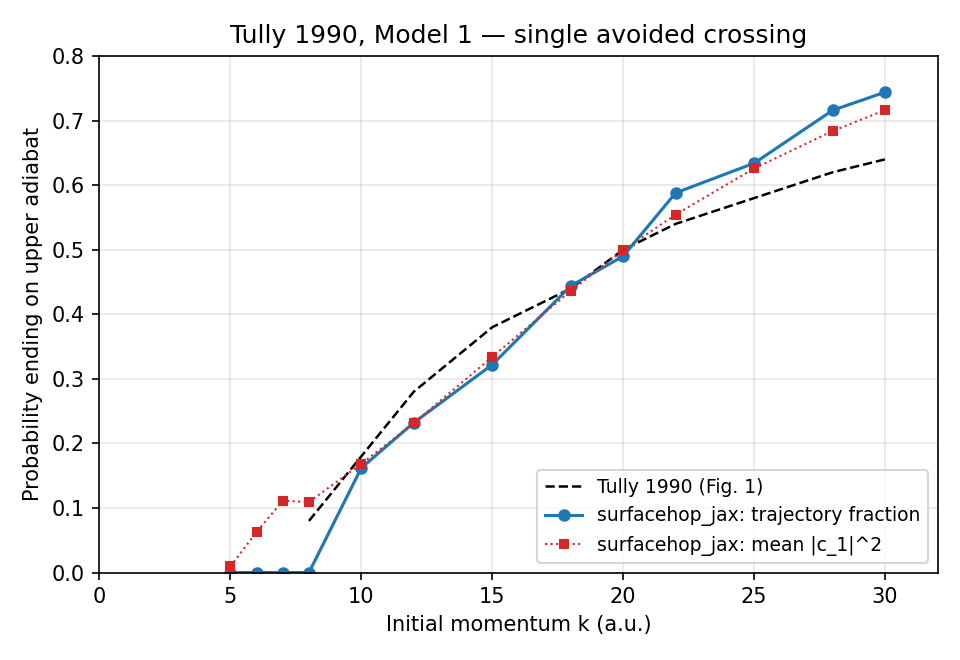
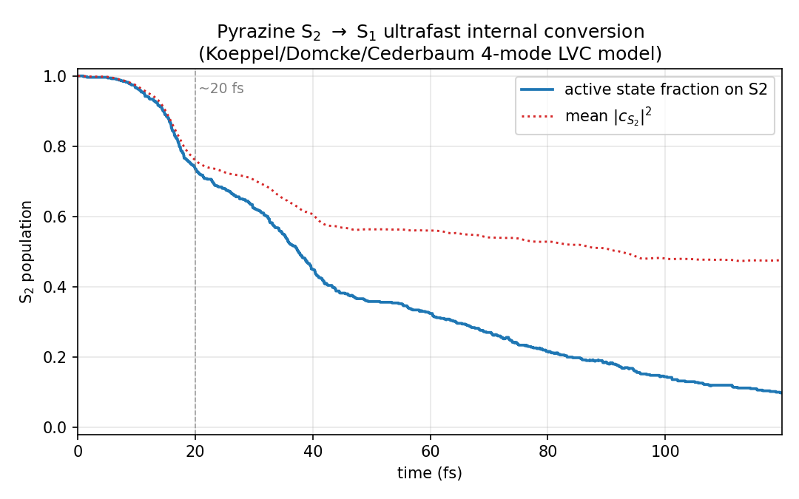

# surfacehop_jax

**Differentiable fewest-switches surface hopping (FSSH) in JAX.**

A clean, JIT-compiled, `vmap`-parallel implementation of Tully-style
mixed quantum-classical nonadiabatic dynamics. Supports both 1D model
problems (Tully 1990 Models 1-3) and arbitrary multi-dimensional
**linear vibronic coupling (LVC)** Hamiltonians for real photochemistry,
including a ready-made factory for the canonical 4-mode pyrazine S1/S2
benchmark.

## Why JAX?

* **JIT** — the full propagator (velocity Verlet + matrix-exp TDSE + FSSH
  hopping + frustrated-hop handling) compiles to one XLA program. Both
  the 1D and N-D paths run from the same code.
* **vmap** — an ensemble of N trajectories runs as a single batched
  call. No Python `for` loops, no per-trajectory subprocess overhead,
  trivially GPU-parallel.
* **autodiff** — the diabatic-to-adiabatic transform is one line:
  `jax.jacrev(H)(x)` gives the full Jacobian and the rest follows from
  Hellmann-Feynman. The dynamics is therefore *differentiable through
  trajectories*, enabling gradient-based optimisation of model
  parameters, fitting LVC Hamiltonians to experimental TR-PES data, or
  training ML potentials in-the-loop.

## Installation

```bash
git clone https://github.com/<you>/surfacehop_jax.git
cd surfacehop_jax
pip install -e .[test]
```

For GPU support, install `jaxlib` with CUDA via the official JAX install
instructions (https://jax.readthedocs.io/en/latest/installation.html).
Everything in `surfacehop_jax` is `vmap`-compatible and runs on GPU with
zero code changes; ensembles of 10k+ trajectories become tractable on a
single workstation GPU.

## Documentation

A full user guide lives in [`docs/`](docs/README.md):

- [01 — Introduction](docs/01-introduction.md): what FSSH is and why this package exists
- [02 — Installation](docs/02-installation.md): setup, GPU, testing
- [03 — Theory](docs/03-theory.md): every line of the FSSH algorithm explained
- [04 — Quickstart](docs/04-quickstart.md): three runnable examples
- [05 — Models](docs/05-models.md): Tully, LVC, custom Hamiltonians
- [06 — API reference](docs/06-api.md): every public function
- [07 — Wigner sampling](docs/07-wigner-sampling.md): initial conditions in dimensionless coords
- [08 — Decoherence](docs/08-decoherence.md): EDC theory and usage
- [09 — Differentiable workflows](docs/09-differentiable-workflows.md): `jax.grad` through trajectories
- [10 — Performance](docs/10-performance.md): JIT, vmap, GPU scaling
- [11 — Troubleshooting](docs/11-troubleshooting.md): the things that have actually gone wrong

The notebook [`notebooks/differentiable_dynamics.ipynb`](notebooks/differentiable_dynamics.ipynb) walks through end-to-end gradient-based parameter fitting.

## Quickstart — 1D (Tully Model 1)

```python
import jax, jax.numpy as jnp
import surfacehop_jax as sh

model = sh.TullyModel1()
H = model.hamiltonian()
init = sh.initialize(H, x0=jnp.array([-10.0]),
                        v0=jnp.array([15.0 / 2000.0]),
                        initial_state=0, nel=2)
final, history = sh.simulate(H, model.masses, init,
                             dt=2.0, n_steps=5000,
                             key=jax.random.PRNGKey(0))
print("Final state:", int(final.state))
```

## Quickstart — multi-dimensional photochemistry (pyrazine)

```python
import jax, jax.numpy as jnp
import surfacehop_jax as sh

model = sh.pyrazine_4mode()                    # 2 states x 4 modes
H = model.hamiltonian()

# Wigner-sample 500 initial conditions at the Franck-Condon point
n_traj = 500
key_qp, key_dyn = jax.random.split(jax.random.PRNGKey(0))
Q0, P0 = sh.sample_phase_space(
    key_qp, jnp.zeros(4), jnp.zeros(4),
    model.frequencies, model.masses, n_samples=n_traj
)
V0 = P0 / model.masses
init = jax.vmap(lambda q, v: sh.initialize(H, q, v, 1, 2))(Q0, V0)

# Propagate for 120 fs.  1 au of time = 0.0242 fs.
final, hist = sh.run_ensemble(H, model.masses, init,
                              dt=1.0, n_steps=4960, key=key_dyn)
# Active-state population on S2 as a function of time
import numpy as np
p_s2 = (np.asarray(hist.active_state) == 1).mean(axis=0)
```

## Building your own LVC model

```python
import jax.numpy as jnp
from surfacehop_jax import LinearVibronicCoupling

# 3 electronic states, 5 normal modes
nel, nmodes = 3, 5
omega = jnp.array([...])         # mode frequencies (Hartree), shape (nmodes,)
energies = jnp.array([...])      # vertical excitations (Hartree), shape (nel,)
# Coupling tensor: diag entries are kappa^(i), off-diag are lambda^(ij)
coupling = jnp.zeros((nel, nel, nmodes))
coupling = coupling.at[0, 0].set(kappa_S0)     # state-0 gradient vector
coupling = coupling.at[1, 1].set(kappa_S1)
coupling = coupling.at[2, 2].set(kappa_S2)
coupling = coupling.at[0, 1].set(lambda_01)    # symmetric off-diagonals
coupling = coupling.at[1, 0].set(lambda_01)
# ...
model = LinearVibronicCoupling(
    energies=energies,
    frequencies=omega,
    coupling=coupling,
)
```

LVC parameters typically come from electronic-structure calculations at a
reference geometry: vertical energies from any excited-state method (TDDFT,
CASSCF, EOM-CCSD, ...), and kappa / lambda from gradients and interstate
couplings along the normal modes. The companion package
[`nma_jax`](https://github.com/mowgliamu/NormalModeAnalysis) supplies the
normal modes; once you have those plus a few gradient evaluations, an
LVC model is just an array constructor.

## Validation

### Tully 1990 Model 1 — single avoided crossing



Reproduces Tully's 1990 transmission curve. The trajectory-fraction curve
(blue) and the mean-|c_1|^2 curve (red dotted) lie on top of each other —
the *internal consistency* property of a correctly-implemented FSSH —
and both track the digitised reference (black dashed) within statistical
noise.

### Pyrazine S2 -> S1 ultrafast internal conversion



The 4-mode Koeppel/Domcke/Cederbaum LVC model shows the canonical
~20-fs decay of the S2 active-state population through the
B_1g-mode-driven conical intersection.

### Decoherence: bare FSSH vs Granucci-Persico EDC


The well-known FSSH over-coherence (the gap between active-state
fraction and mean `|c|^2`) is repaired by the Granucci-Persico
energy-decoherence correction (Zhu-Truhlar form). Switch it on with
a single keyword:

```python
from surfacehop_jax.decoherence import zhu_truhlar
final, hist = sh.run_ensemble(H, model.masses, init,
                              dt=1.0, n_steps=4960, key=key_dyn,
                              decoherence_fn=zhu_truhlar)
```

With EDC enabled, active-state fraction and `|c|^2` lie on top of each
other (internal consistency restored) and the S2 decay timescale shifts
to ~50 fs, in better agreement with high-level MCTDH for this 4-mode
model.

### Differentiable parameter fitting

The headline feature: `jax.grad` flows through the full ensemble propagator
(Wigner sample -> velocity-Verlet -> matrix-exp TDSE -> EDC -> active-state
selection), giving reverse-mode gradients of smooth observables with respect
to LVC parameters in a single backward pass. The notebook
[`notebooks/differentiable_dynamics.ipynb`](notebooks/differentiable_dynamics.ipynb)
walks through the demonstration end-to-end:

1. Sanity check `jax.grad` of the adiabatic energy gap through `jnp.linalg.eigvalsh`
   against centred finite-difference (agreement to ~8e-10, machine precision for
   float64).
2. Differentiate a complete 2000-step `lax.scan` propagation in the
   single-trajectory deterministic regime: autodiff vs FD relative error ~1%
   (the residual is the path-jump bias from one or two flipped hop decisions
   between `lambda +- h`).
3. Map the ensemble loss surface `<P_S2>(lambda)` over 17 grid points and discuss
   the **path-jump artefact**: stochastic hop decisions are step-functions of
   `lambda`, so they vanish from autodiff. The within-path piece preserves the
   gradient sign at every monotonic region of the loss surface, deflated in
   magnitude by ~20x relative to FD.
4. Fit `lambda_10a` to a target `<P_S2> = 0.5` using Adam (25 steps,
   `lr = 0.05`, gradient clipping). Loss drops by 4 orders of magnitude from
   `lambda_0 = 0.10` eV to `lambda* ~ 0.37` eV; convergence at the ensemble
   noise floor.
5. Validation: long-time `<P_S2>(t)` curves at the original vs fitted
   `lambda` on a fresh 128-trajectory ensemble.

This is the inverse problem in nonadiabatic dynamics: tuning a model
Hamiltonian to reproduce an experimental TR-PES decay or a benchmark
quantum calculation, at O(1) gradient cost regardless of parameter
count -- with explicit, honest treatment of the discrete-hop bias inherent
to trajectory surface hopping.

## Algorithmic choices

* **Velocity Verlet** for nuclei (symplectic, energy-conserving away from
  hops). N-dimensional, mass-weighted.
* **Eigenvector phase tracking** between steps. `jnp.linalg.eigh` returns
  eigenvectors with arbitrary sign; each new eigenvector is multiplied by
  the sign that maximises its overlap with the previous one, keeping the
  NAC tensor continuous along the trajectory.
* **Matrix-exponential TDSE step** (`jax.scipy.linalg.expm(G * dt)`)
  rather than `solve_ivp`. The generator `G` is held constant across
  `[t, t+dt]` in this release; interpolating-G higher-order schemes are
  an obvious extension.
* **Cumulative hopping selection**. One uniform RV per step compared
  against the cumulative `sum_j g_{i->j}`. The original Tully algorithm
  of comparing each `g_k` to the same RV is biased for nel >= 3; this
  avoids that.
* **Momentum rescaling along the NAC direction** when a hop fires. Solves
  the energy-conservation quadratic exactly along `d_{ij}/m`; on a
  frustrated hop the velocity component along NAC is reversed (Truhlar
  2002).
* **`LinearVibronicCoupling`** in dimensionless mass-frequency-weighted
  coordinates (Koeppel/Domcke/Cederbaum convention). Effective per-mode
  mass is `1/omega`, so Wigner ground-state widths are
  `sigma_Q = sigma_P = 1/sqrt(2)` for every mode regardless of frequency
  --- a nice side-effect of the dimensionless choice.

## Status

| version | features |
|---|---|
| **v0.1** | 1D, Tully 1990 Models 1-3, ensembles via `vmap`, 39 tests. |
| **v1.0** | N-D, `LinearVibronicCoupling` model class, pyrazine 4-mode factory, 52 tests. |
| **v1.1** (this release) | Granucci-Persico EDC decoherence (Zhu-Truhlar form), differentiable parameter-fitting notebook (`jax.grad` driving Adam), 67 tests. |
| **v2.0** (longer-term) | ML-PES coupling, local-diabatic hopping option, bilinear (quadratic) coupling terms, fits against experimental TR-PES. |

## Tests

```bash
pytest tests/             # fast subset
pytest tests/ -m slow     # the multi-mode benchmarks
```

## Citation

If you use this code, please cite the JOSS paper (placeholder until accepted):

```
@software{surfacehop_jax,
  title  = {surfacehop_jax: differentiable surface hopping in JAX},
  author = {Goel, Prateek},
  url    = {https://github.com/<you>/surfacehop_jax},
  year   = {2026},
}
```

## License

MIT. See `LICENSE` for details.
