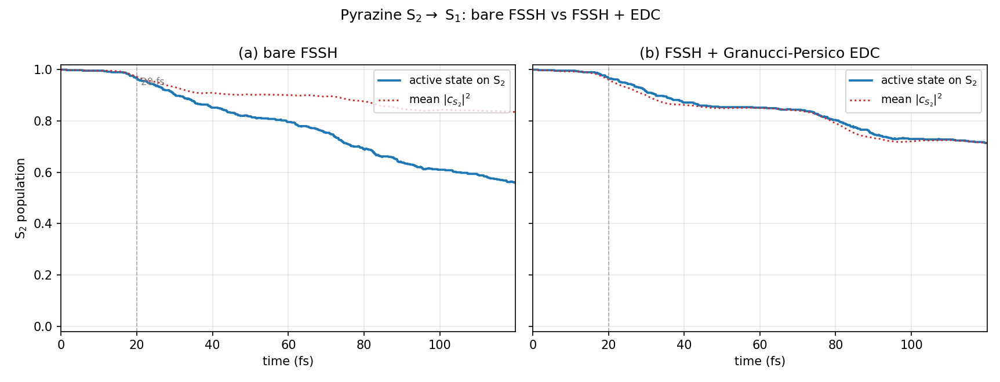

# surfacehop_jax — User Guide

**Version 1.1.0 • Differentiable fewest-switches surface hopping in JAX**

---

# Overview

This directory is the long-form documentation for `surfacehop_jax`. The
top-level [`README.md`](../README.md) is a quick advert; the JOSS paper
[`joss/paper.md`](../joss/paper.md) is the publication. This guide is for
**users who have cloned the repository and want to actually do
something** — run a benchmark, build their own LVC model, fit a parameter
against an experimental observable, or understand why a particular FSSH
result looks the way it does.

## Where to start

| If you want to … | Read these in order |
|---|---|
| Understand what surface hopping is and why this package exists | [01 — Introduction](#1-introduction) → [03 — Theory](#3-theory-the-fssh-algorithm) |
| Just get a calculation running | [02 — Installation](#2-installation) → [04 — Quickstart](#4-quickstart) |
| Set up a real photochemistry model | [04 — Quickstart](#4-quickstart) → [05 — Models](#5-models-built-in-hamiltonians-and-how-to-write-your-own) → [07 — Wigner sampling](#7-wigner-sampling-of-initial-conditions) |
| Use the decoherence correction | [08 — Decoherence](#8-decoherence-corrections) |
| Fit LVC parameters to an observable with `jax.grad` | [09 — Differentiable workflows](#9-differentiable-workflows) and the notebook [`differentiable_dynamics.ipynb`](../notebooks/differentiable_dynamics.ipynb) |
| Run large ensembles on a GPU | [10 — Performance](#10-performance-jit-vmap-gpu) |
| Look up a function | [06 — API reference](#6-api-reference) |
| Diagnose a crash or a wrong-looking number | [11 — Troubleshooting](#11-troubleshooting) |

## Table of contents

1. [Introduction — what surface hopping is and why this package exists](#1-introduction)
2. [Installation and testing](#2-installation)
3. [Theory — the FSSH algorithm in detail](#3-theory-the-fssh-algorithm)
4. [Quickstart — three working examples](#4-quickstart)
5. [Models — built-in and custom Hamiltonians](#5-models-built-in-hamiltonians-and-how-to-write-your-own)
6. [API reference](#6-api-reference)
7. [Wigner sampling of initial conditions](#7-wigner-sampling-of-initial-conditions)
8. [Decoherence corrections](#8-decoherence-corrections)
9. [Differentiable workflows — `jax.grad` through trajectories](#9-differentiable-workflows)
10. [Performance — JIT, vmap, GPU](#10-performance-jit-vmap-gpu)
11. [Troubleshooting](#11-troubleshooting)

## Conventions used in this guide

- **Atomic units everywhere.** Energies in Hartree, masses in electron
  masses, distances in Bohr, time in atomic units of time
  (1 a.u. = 0.0242 fs). The constants module exports the conversions if
  you need them: `surfacehop_jax.constants.HARTREE_TO_EV`,
  `AU_OF_TIME_TO_FS`, etc.
- **All array shapes are spelled out.** `(nel,)` means an array indexed
  by electronic state, `(ndim,)` by nuclear coordinate, `(n_traj,)` by
  trajectory in an ensemble, and so on.
- **Code examples are runnable as written**, given a working install
  and the imports shown at the top of each section.
- **Mathematical equations** use LaTeX. GitHub now renders inline
  `$...$` and display `$$...$$` math directly in markdown.

## Other resources

- The Jupyter notebook
  [`notebooks/differentiable_dynamics.ipynb`](../notebooks/differentiable_dynamics.ipynb)
  is the canonical end-to-end demonstration of gradient-based parameter
  fitting.
- The example scripts in [`examples/`](../examples) reproduce the figures
  in the JOSS paper.
- The test suite under [`tests/`](../tests) is also useful as
  documentation — every public function has at least one short, readable
  test that exercises it.


---

# Chapter 1: Introduction

## What surface hopping is

Most of computational chemistry rests on the **Born–Oppenheimer
approximation**: nuclei are heavy and slow, electrons are light and
fast, so we solve for the electrons at fixed nuclear positions to get a
single potential-energy surface $V(\mathbf{R})$ and then propagate the
nuclei on that surface. This works beautifully for ground-state
chemistry. It fails — sometimes spectacularly — when two electronic
states come close in energy and the nuclear motion can switch between
them. Photochemistry is full of these situations:

- A molecule absorbs a UV photon, lands on an excited surface, slides
  toward a region where that surface kisses a lower one (a *conical
  intersection*), and decays radiationlessly to the ground state in
  tens of femtoseconds.
- A solar-cell heterojunction transfers a photogenerated electron from
  one chromophore to its neighbour by hopping between adjacent
  diabatic states whenever the gap closes.
- A photoisomerisation (vision in the retina, photoswitches in
  molecular machines) is a non-adiabatic transition along a torsional
  coordinate.

For these problems we need **nonadiabatic** molecular dynamics: nuclei
that can change electronic state during their motion. The exact
treatment is the full time-dependent Schrödinger equation in the
nuclear–electronic space, which beyond a handful of degrees of freedom
is intractable. Tully's *fewest-switches surface hopping* (FSSH,
introduced in [Tully 1990][tully]) is the most widely used
classical-trajectory approximation: each trajectory follows Newton's
equations on **one** adiabatic surface at any instant, but is allowed
to switch ("hop") to a neighbouring surface stochastically, with a
probability constructed so that the swarm of trajectories reproduces
the populations given by the time-dependent Schrödinger equation.

> The "fewest-switches" criterion is what makes FSSH efficient: the hop
> probability is chosen to be the *minimum* number of hops consistent
> with maintaining the correct ensemble populations. Naive
> "always-hop-when-coupled" schemes overcount transitions; pure mean-
> field methods (Ehrenfest) underweight the influence of strong but
> brief couplings. FSSH threads the needle.

## What this package provides

`surfacehop_jax` is a clean re-implementation of FSSH in the JAX
numerical framework. Three things follow from that choice:

1. **JIT compilation.** The full propagator — velocity-Verlet for
   nuclei, exact matrix exponential for the electronic TDSE, hopping
   decision, momentum rescaling on hop, frustrated-hop reflection —
   compiles to a single XLA program. There is no Python overhead per
   step.

2. **Vectorisation over an ensemble.** An ensemble of $N$ trajectories
   is a single `jax.vmap` of the per-trajectory propagator. Once
   compiled it runs as one batched program: zero per-trajectory Python
   overhead, and transparent GPU execution for "free" 10k-trajectory
   ensembles on consumer hardware.

3. **End-to-end differentiability.** Every line of the propagator is a
   pure JAX function, so `jax.grad` can reverse-mode-differentiate any
   smooth observable of the final state with respect to any input
   parameter — a coupling strength, an excitation energy, a frequency,
   a Wigner-distribution width, the weights of an ML-trained potential.
   This is what unlocks the *inverse problem*: fit a model Hamiltonian
   to an experimental observable using exactly the gradient machinery
   that trains neural networks.

The package also ships convenience models that turn what is normally a
multi-week setup task into one-liners:

- The three [`TullyModel{1,2,3}`](#52-tully-1990-models)
  benchmarks from the 1990 paper. Useful for sanity checks, teaching,
  and validating any new feature.
- A general [`LinearVibronicCoupling`](#53-linear-vibronic-coupling)
  class for the Köppel–Domcke–Cederbaum diabatic Hamiltonian. You
  supply vertical excitation energies, mode frequencies, and the
  $\kappa, \lambda$ tensors; it returns a JAX-traceable Hamiltonian.
- A [`pyrazine_4mode()`](#54-the-pyrazine-4-mode-benchmark)
  factory that returns the canonical 4-mode pyrazine S₁/S₂ benchmark
  used throughout the nonadiabatic-dynamics literature.

## When to use `surfacehop_jax`

This is a *model Hamiltonian* code, not an on-the-fly ab initio one.
You should reach for it when:

- you have an analytic or pre-fit Hamiltonian (LVC, Marcus-like
  bilinear, lattice models, ML-PES) and want fast ensemble dynamics on
  it;
- you want gradient-based fitting of model parameters against an
  experimental observable;
- you want to embed nonadiabatic dynamics inside a larger
  differentiable pipeline (e.g. inverse design of a chromophore for a
  target decay rate, or training an ML potential against quantum
  reference trajectories);
- you want a small, readable, hackable FSSH propagator (~400 lines)
  rather than a hundred-thousand-line legacy package.

You should reach for SHARC, Newton-X, JADE, or PYXAID instead when:

- you need on-the-fly couplings from a quantum-chemistry program
  (CASSCF, MS-CASPT2, ADC(2), LR-TDDFT);
- you need spin-orbit coupling, intersystem crossing, or relativistic
  effects;
- you need atom-feature outputs (geometries, dipoles, photoelectron
  spectra computed per step) for direct comparison to experiment.

In practice, model-Hamiltonian dynamics and on-the-fly dynamics are
complementary: an LVC model fit to a few hundred ab initio points and
then propagated by `surfacehop_jax` gives you a converged ensemble in
seconds; an on-the-fly run gives you spectroscopic observables you
could not parameterise into a model. The companion package
[`nma_jax`](https://github.com/mowgliamu/NormalModeAnalysis) bridges
the two: it produces the normal modes you need to define an LVC
Hamiltonian in the first place.

## What's in the package

```
surfacehop_jax/
├── surfacehop_jax/             # the package itself, ~1000 lines
│   ├── __init__.py             # public API
│   ├── constants.py            # HBAR, conversions
│   ├── models.py               # TullyModel{1,2,3}, LinearVibronicCoupling, pyrazine_4mode
│   ├── pes.py                  # diabatic → adiabatic transform (energies, gradients, NACs)
│   ├── dynamics.py             # TrajectoryState, step, simulate, run_ensemble
│   ├── wigner.py               # HO ground-state Wigner sampling
│   └── decoherence.py          # Granucci–Persico EDC corrections
├── tests/                      # 67 tests across all modules
├── examples/                   # runnable example scripts
├── notebooks/                  # Jupyter notebooks (parameter fitting)
├── docs/                       # this guide
└── joss/                       # JOSS paper sources
```

Onward to [installation](#2-installation).

[tully]: https://doi.org/10.1063/1.459170 "Tully 1990, J. Chem. Phys. 93, 1061"


---

# Chapter 2: Installation

## Requirements

- Python ≥ 3.10 (uses dataclasses, the new typing union syntax, and
  `Self`-style annotations).
- JAX ≥ 0.4. `jaxlib` is bundled with `jax` for CPU; for GPU follow the
  official JAX install instructions (link below).
- `numpy`, `optax` (for the parameter-fit notebook), `matplotlib`
  (examples and the notebook).
- `pytest` for the test suite.

`surfacehop_jax` enables JAX's `float64` mode on import (see
[`__init__.py`](../surfacehop_jax/__init__.py)). Eigendecompositions
of nearly-degenerate Hamiltonians and long propagations both lose
precision in `float32`, so this is deliberate. If you mix
`surfacehop_jax` with another package that assumes `float32`, you'll
need to be careful about where each library promotes/demotes dtypes.

## From a clone

The typical install for development or notebook use:

```bash
git clone https://github.com/mowgliamu/surfacehop_jax.git
cd surfacehop_jax
pip install -e .[test]
```

The editable (`-e`) install lets you patch the source and re-run tests
without reinstalling. The `[test]` extras pull in `pytest` and matplotlib.

## GPU install

JAX maintains the canonical GPU install instructions at
<https://jax.readthedocs.io/en/latest/installation.html>. The short
version on a Linux box with a recent NVIDIA driver:

```bash
pip install --upgrade "jax[cuda12]"
```

Then install `surfacehop_jax` on top:

```bash
pip install -e .
```

**`surfacehop_jax` itself contains no GPU-specific code.** Every
function in the package is `vmap`- and `jit`-compatible; whether it runs
on CPU or GPU is determined entirely by which `jaxlib` you have
installed and which device the inputs live on. The same example scripts
that run in a few seconds on CPU run an ensemble of thousands of
trajectories in the same wall time on a single consumer GPU.

To confirm the GPU is being seen:

```python
import jax
print(jax.devices())
# CPU-only: [CpuDevice(id=0)]
# GPU:      [CudaDevice(id=0)]   (or similar)
```

If `jax.devices()` returns `CpuDevice` despite having installed the
CUDA wheel, the most common culprit is a mismatched CUDA-toolkit /
driver version. JAX's install page has a CUDA-version compatibility
table.

## Testing the install

```bash
pytest tests/             # fast subset, runs in ~4 minutes on a laptop CPU
pytest tests/ -m slow     # the Tully Model 1 momentum-scan benchmark; ~30 minutes on CPU
```

The default `pytest tests/` skips tests marked `slow`. The slow group is
the full Tully-1 momentum scan: 25 momenta × 500 trajectories each, with
a tolerance check against a digitised reference curve. It is what we
*publish* in the JOSS paper but is not required for everyday use.

If everything passes (61 fast tests, 6 slow tests = 67 total at v1.1)
you're done.

## Common install issues

**`jaxlib` not found.** Usually means `pip` resolved a `jax` version
newer than the `jaxlib` it can find on your platform. Pinning both
versions usually fixes it; see the JAX install matrix.

**`jax.config.update("jax_enable_x64", True)` fails or is ignored.**
If you imported JAX before `surfacehop_jax`, JAX has already cached its
default dtype as `float32`. The package enables `x64` at import time,
which is the right time — but if some upstream module disables it
later, our eigendecompositions may give you garbage. Put
`import surfacehop_jax` as early as practical, ideally before any
other JAX-using import in your script.

**`ModuleNotFoundError: optax`.** The differentiable-fitting notebook
uses `optax` for Adam. The minimal install does not pull it in
automatically; `pip install optax` is enough.

**On macOS, `pip install -e .` complains about `setuptools`.** Newer
`pip` defaults to PEP 517 builds. Either upgrade `pip`/`setuptools` or
use `pip install --use-pep517 -e .` explicitly.

## Next

If you want the conceptual picture before running anything,
continue to [03 — Theory](#3-theory-the-fssh-algorithm). If you'd rather see code
first, jump to [04 — Quickstart](#4-quickstart).


---

# Chapter 3: Theory — the FSSH algorithm

This chapter explains what every line of `surfacehop_jax.dynamics.step`
actually does. If you just want to run a calculation, skip to
[Quickstart](#4-quickstart) and come back later; nothing in the
package's public API requires reading this chapter. But if a number
looks wrong, or you want to extend the propagator, this is where to
start.

## 3.1 Diabatic vs adiabatic representations

For a system with $n_\mathrm{el}$ electronic states and a nuclear
coordinate vector $\mathbf{Q}$ of dimension $n_\mathrm{dim}$, the
electronic Hamiltonian at a fixed nuclear geometry is an
$n_\mathrm{el} \times n_\mathrm{el}$ matrix $\mathbf{H}(\mathbf{Q})$.
You can pick the basis you write it in:

- The **diabatic** basis is whatever convenient basis you set up at a
  reference geometry — typically the eigenstates of $\mathbf{H}$ there.
  The diabatic Hamiltonian is then *smooth in $\mathbf{Q}$* away from
  the reference, but generally **not diagonal**: at other geometries
  the diabatic basis is no longer an eigenbasis of $\mathbf{H}$.
- The **adiabatic** basis is, at every $\mathbf{Q}$, the eigenbasis of
  $\mathbf{H}(\mathbf{Q})$. In this basis $\mathbf{H}$ is diagonal at
  every point — the diagonal entries are the *adiabatic surfaces*
  $E_i(\mathbf{Q})$ — but the basis itself rotates with $\mathbf{Q}$,
  so the time derivative picks up coupling terms
  $\mathbf{d}_{ij}(\mathbf{Q}) =
  \langle \psi_i(\mathbf{Q}) | \nabla_\mathbf{Q} \psi_j(\mathbf{Q}) \rangle$,
  the **non-adiabatic coupling vectors** (NACs).

`surfacehop_jax` takes the diabatic Hamiltonian as user input (it's the
natural form for an LVC or for an ML-fit potential) and computes
adiabatic energies, gradients, and NACs internally via autodiff. The
trajectory itself lives on adiabatic surfaces — this is what "surface"
in "surface hopping" refers to.

### How `adiabatic_quantities` works

Given any callable `H(x) -> (nel, nel)` Hermitian matrix,
[`pes.adiabatic_quantities`](../surfacehop_jax/pes.py) returns the
energies, gradients, NACs, and eigenvectors at a single point `x`:

```python
H = diab_h_fn(x)                              # (nel, nel)
energies, eigvecs = jnp.linalg.eigh(H)        # (nel,), (nel, nel)
dH = jax.jacrev(diab_h_fn)(x)                 # (nel, nel, ndim)
T  = jnp.einsum("ai,abk,bj->ijk",
                eigvecs, dH, eigvecs)         # (nel, nel, ndim)
```

`T[i, j, k]` is $\langle \psi_i | \partial H / \partial x_k | \psi_j\rangle$,
the matrix element of the nuclear gradient of the (diabatic) Hamiltonian
sandwiched between adiabatic eigenstates. By Hellmann–Feynman:

$$
\frac{\partial E_i}{\partial x_k} = T_{iik},
$$

$$
\mathbf{d}_{ij}^{(k)} = \frac{T_{ijk}}{E_j - E_i} \quad (i \neq j).
$$

That's it — one `eigh`, one `jacrev`, and one `einsum`, and we have
everything the FSSH propagator needs. The `1/(E_j - E_i)` denominator
is handled with the "double-where" pattern to avoid NaN gradients on
the diagonal.

## 3.2 The two equations of motion

A single FSSH trajectory carries two pieces of state besides position
and velocity:

1. **Active state** `s ∈ {0, 1, ..., nel-1}`: the adiabatic surface the
   nuclei are currently moving on. Integer.
2. **Electronic coefficients** $\mathbf{c}(t) \in \mathbb{C}^{n_\mathrm{el}}$:
   the complex amplitudes of an electronic wavefunction
   $\Psi(t) = \sum_i c_i(t) \, \psi_i(\mathbf{Q}(t))$ propagated along
   the trajectory. Normalised: $\sum_i |c_i|^2 = 1$.

### Nuclear EOM

Newton's equations on the active surface:

$$
m_k \ddot{Q}_k = -\frac{\partial E_s}{\partial Q_k}.
$$

We integrate this with velocity Verlet, which is symplectic and so
conserves energy on average between hops (drift is purely from the
discrete hops themselves; see momentum rescaling below).

### Electronic EOM

The amplitudes evolve under the time-dependent Schrödinger equation in
the adiabatic basis, with the nuclear velocity coupling adiabatic
states through their NACs:

$$
i\hbar \, \dot{c}_i = E_i \, c_i - i\hbar \sum_j (\mathbf{v} \cdot \mathbf{d}_{ij}) \, c_j.
$$

Define the generator

$$
G_{ij} = -\frac{i E_i}{\hbar} \delta_{ij} - \mathbf{v} \cdot \mathbf{d}_{ij}.
$$

Then $\dot{\mathbf{c}} = \mathbf{G} \mathbf{c}$, and we propagate over a
nuclear step $\Delta t$ by exact matrix exponential:

$$
\mathbf{c}(t + \Delta t) = e^{\mathbf{G}\,\Delta t} \, \mathbf{c}(t).
$$

This is `jax.scipy.linalg.expm(G * dt) @ coeffs` in the code. It is
exact for constant $\mathbf{G}$ over the step (we hold the NACs and
velocity fixed across $[t, t+\Delta t]$). Higher-order integrators that
interpolate $\mathbf{G}(t)$ across the step would be a straightforward
extension; the matrix-exponential single-step scheme is robust and
sufficient for time steps $\Delta t \lesssim 1$ a.u. ≈ 0.024 fs in
typical photochemistry problems.

> **Why matrix exponential instead of `solve_ivp`?** The naive choice
> would be SciPy's `solve_ivp` with RK45 or LSODA. Both work, but
> complex-valued ODE support in SciPy is poor (you have to split into
> real/imaginary parts), and neither is `jit`-able or `vmap`-able.
> Matrix exponential is exact for constant generator, JAX-native, and
> the entire electronic step compiles into XLA.

## 3.3 The fewest-switches hop probability

Tully's central result: if you ask "what is the smallest rate of
$i \to j$ hops in the ensemble that keeps the fraction of trajectories
on state $j$ equal to $\langle |c_j|^2 \rangle$?", you get

$$
P_{i \to j}(t \to t + \Delta t) = \max\!\left\{0,\;
\frac{2\,\Delta t \, \mathrm{Re}\!\left[\rho_{ij}^{*}\,(\mathbf{v} \cdot \mathbf{d}_{ij})\right]}{\rho_{ii}}\right\},
$$

where $\rho_{ij} = c_i c_j^{*}$ is the (one-trajectory) density matrix.
The numerator is the flux of population *out* of state $i$ along the
$i$–$j$ coupling channel; dividing by $\rho_{ii}$ converts it to a
*conditional* transition probability given we're currently in $i$.

In `step()` this reads:

```python
b = 2.0 * jnp.real(jnp.conj(rho[state.state, :]) * vdotd)
g = jnp.maximum(0.0, b * dt / (rho_ii + 1e-30))
g = g.at[state.state].set(0.0)                # never "hop to self"
```

> **A subtle sign.** The derivation in Tully 1990 has terms with both
> $\mathbf{d}_{ij}$ and $\mathbf{d}_{ji} = -\mathbf{d}_{ij}$
> (antisymmetry of the NAC tensor). Depending on which index you
> "factor out" of the $\mathrm{Re}[\cdots]$ trace, you get either a
> plus or a minus sign in front. The correct convention, verified by
> reproducing Tully Model 1 transmission within statistical noise, is
> `b = +2 Re(rho[i,j]^* v·d[i,j])`. An early bug in this package had
> the wrong sign; trajectories ran but the transmission curve was
> wrong. The Tully-1 benchmark test (`tests/test_tully1_benchmark.py`)
> guards against this.

### Selecting the target state from the probabilities

For $n_\mathrm{el} = 2$ the hop decision is just one comparison. For
$n_\mathrm{el} \geq 3$ Tully's original algorithm "draw a uniform
$u$, hop to state $j$ if $u < g_{i \to j}$" is *biased*: with three
states and equal probabilities to states 1 and 2, comparing the same
$u$ to each one in sequence is not the same as drawing one outcome
from a categorical distribution. The unbiased version is the
**cumulative-probabilities scheme**:

```python
cum = jnp.cumsum(g)
u = jax.random.uniform(key, ())
target = jnp.argmax(cum > u)      # first bin where cumulative > u
```

This is what `surfacehop_jax` uses. It's correct for any number of
states and reduces to the single-`u`-comparison for $n_\mathrm{el} = 2$.

## 3.4 Momentum rescaling on a hop

When the trajectory hops from state $i$ to state $j$, the total energy
must be conserved. The classical kinetic energy must absorb the change
in potential energy $\Delta E = E_i - E_j$ (positive when going *down*,
so kinetic energy increases). Tully prescribes that the rescaling is
applied **along the NAC direction**:

$$
\mathbf{v}_\mathrm{new} = \mathbf{v} - \gamma\,\frac{\mathbf{d}_{ij}}{\mathbf{m}},
$$

with $\gamma$ found by solving the quadratic from energy conservation:

$$
\tfrac{1}{2}\sum_k \frac{d_{ij,k}^{2}}{m_k}\,\gamma^{2}
\;-\;(\mathbf{v}\cdot\mathbf{d}_{ij})\,\gamma
\;-\;\Delta E = 0.
$$

This has two real roots when the discriminant is non-negative; Tully's
prescription (refined by Hammes-Schiffer & Tully 1994) is to take the
root closer to zero (minimal velocity perturbation).

### Frustrated hops

If the discriminant is negative, there is no real $\gamma$ that
conserves energy: the trajectory is trying to hop *up* into a state it
doesn't have enough kinetic energy along the NAC to reach. This is a
**frustrated hop**. The trajectory stays on its original state, but
Truhlar's 2002 prescription is to **reverse** the velocity component
along the NAC:

$$
\mathbf{v}_\mathrm{new} = \mathbf{v} - \frac{2(\mathbf{v}\cdot\mathbf{d}_{ij})}{\sum_k d_{ij,k}^{2}/m_k}\,\frac{\mathbf{d}_{ij}}{\mathbf{m}}.
$$

This reflects the trajectory back toward the coupling region for
another chance at a successful hop on a later step, and gives better
detailed balance than simply "do nothing". It is what `surfacehop_jax`
implements.

> **Implementation detail.** The momentum-rescaling routine is invoked
> *unconditionally* on every step (with a placeholder NAC vector of
> zero when no hop is attempted), then the caller selects the
> pre-hop velocity if no hop occurred. This avoids a `lax.cond` that
> XLA can't fully optimise. The "double-where" pattern around the
> discriminant prevents `0/0` from poisoning the autodiff backward pass.

## 3.5 The eigenvector phase problem

`jnp.linalg.eigh` is an excellent eigensolver, but it returns
eigenvectors with **arbitrary signs**: nothing in the eigen problem
distinguishes $\boldsymbol{\psi}$ from $-\boldsymbol{\psi}$. As the
trajectory walks across the PES, the sign returned at step $t+\Delta t$
may flip independently for each eigenvector. The NAC vectors
$\mathbf{d}_{ij}$ depend on the *relative* phases of $\psi_i$ and
$\psi_j$, so an unflagged sign flip would invert the sign of the NAC
between steps and turn the trajectory into nonsense.

`pes.fix_eigenvector_phase(new, old)` returns a length-`nel` vector of
$\pm 1$ signs such that each new eigenvector best overlaps with the
previous one. The next step's eigenvectors are multiplied by these
signs before the NACs are computed. This makes the NAC tensor
continuous along the trajectory.

Two failure modes to keep in mind:

1. At an **exact** conical intersection, the eigenvalues are degenerate
   and `eigh` returns an arbitrary basis. Phase tracking based on
   single-step overlap fails. In practice for finite-dimensional model
   Hamiltonians one never lands on the CoIn exactly; if you find
   trajectories blowing up on a specific step, the time step is
   probably too large, or you are very near (but not on) a CoIn and
   should reduce $\Delta t$ near coupling regions.

2. For trajectories that explore the coordinate widely, the
   single-step phase-tracking heuristic can drift over very many
   steps. The propagator is internally consistent — phase is corrected
   step-to-step — but if you compare absolute eigenvector orientations
   across thousand-step trajectories, expect arbitrary sign flips.
   Observables are sign-invariant.

## 3.6 Internal consistency

A correctly implemented FSSH satisfies the **internal-consistency**
property: the fraction of trajectories on adiabatic state $j$ at time
$t$ should equal the ensemble-averaged $|c_j(t)|^2$:

$$
\frac{1}{N_\mathrm{traj}} \sum_{\alpha=1}^{N_\mathrm{traj}}
\mathbf{1}[s^{(\alpha)}(t) = j]
\;\overset{?}{=}\;
\frac{1}{N_\mathrm{traj}} \sum_\alpha |c_j^{(\alpha)}(t)|^{2}.
$$

This is the whole point of the fewest-switches construction. If your
trajectory fraction is systematically far from the average $|c|^2$,
something is wrong:

- **Both curves agree but disagree with the exact-quantum reference.**
  Expected near conical intersections — this is the classic FSSH
  over-coherence, not an implementation bug. See [Decoherence
  corrections](#8-decoherence-corrections).
- **The two curves diverge as time goes on.** Probable bug: wrong
  sign in `b`, missing/wrong frustrated-hop handling, wrong NAC
  computation, eigenvector phase not tracked.

The Tully-1 benchmark (`tests/test_tully1_benchmark.py`) checks both
internal consistency and the transmission curve against Tully's 1990
published values; it would catch the major implementation bugs in this
category.

## 3.7 What FSSH gets wrong, and what to do about it

The known shortcomings of FSSH, in rough order of severity:

1. **Over-coherence.** The electronic wavefunction stays a coherent
   superposition long after the underlying nuclear wavepackets would
   have decohered. Repaired with the Granucci–Persico EDC
   ([Chapter 8](#8-decoherence-corrections)).
2. **Frustrated-hop direction.** Truhlar's velocity-reflection is the
   most common prescription but not the only one; for some systems the
   "do nothing" or "reverse only momentum component" alternatives give
   different long-time behaviour.
3. **Wavepacket branching information is lost.** Each trajectory makes
   a hard choice at each hop; the wavepacket character of an actual
   nuclear wavefunction is not represented. Decoherence corrections
   mitigate this but don't eliminate it.
4. **Spatial spread of the wavepacket is not represented.** A single
   classical trajectory has no width. The Wigner-sampled ensemble
   recovers the width of the initial state, but coherent quantum
   effects (interference between branches) are lost.
5. **The classical limit is enforced too aggressively.** Tunneling and
   zero-point motion are recovered only via the initial Wigner sample;
   neither develops dynamically.

For a survey of FSSH variants and improvements, see Subotnik et al.,
*Annu. Rev. Phys. Chem.* **67**, 387 (2016).

## Next

Now that the theory is laid out, see how it translates to working code
in [04 — Quickstart](#4-quickstart).


---

# Chapter 4: Quickstart

Three runnable examples, each more involved than the last. They mirror
the example scripts in [`examples/`](../examples). Run any of them in a
fresh Python session.

## 4.1 A single Tully-1 trajectory

Tully's Model 1 is a one-dimensional, two-state avoided crossing. It is
the simplest non-trivial FSSH problem.

```python
import jax
import jax.numpy as jnp
import surfacehop_jax as sh

model = sh.TullyModel1()
H = model.hamiltonian()         # callable: H(x) -> (2, 2) Hermitian

# Initial conditions: incoming wavepacket on the lower adiabat, k = 15
init = sh.initialize(H,
                     x0=jnp.array([-10.0]),
                     v0=jnp.array([15.0 / 2000.0]),   # k / m
                     initial_state=0,
                     nel=2)

final, history = sh.simulate(H, model.masses,
                             init,
                             dt=2.0, n_steps=5000,
                             key=jax.random.PRNGKey(0))

print(f"Final state: {int(final.state)}")
print(f"Final |c|² populations: {jnp.abs(final.coeffs)**2}")
print(f"Energy conservation: ΔE = {float(history.total_energy[-1] - history.total_energy[0]):+.2e} Ha")
```

What you should see: the final state is `0` (still on the lower adiabat
— transmission) or `1` (jumped to the upper — reflection) depending on
the random key, and energy is conserved to better than $10^{-5}$ Ha
over the whole 10 000-step trajectory.

`history` is a `StepDiagnostics` named-tuple whose fields are stacked
along a leading time axis of length `n_steps`:

- `history.total_energy` shape `(n_steps,)` — useful for energy-conservation tests
- `history.population` shape `(n_steps, nel)` — $|c_i|^2$ as a function of time
- `history.active_state` shape `(n_steps,)` — the adiabatic state at each step
- `history.hopped`, `history.frustrated` — booleans flagging successful and frustrated hop attempts

## 4.2 A pyrazine ensemble

For a real photochemistry calculation we need (a) a multi-dimensional
model, and (b) an ensemble of Wigner-sampled initial conditions. Both
are one-liners.

```python
import jax
import jax.numpy as jnp
import numpy as np
import surfacehop_jax as sh

model = sh.pyrazine_4mode()        # 2 states × 4 modes
H = model.hamiltonian()

# Wigner-sample 500 initial conditions at the Franck-Condon point
n_traj = 500
key_qp, key_dyn = jax.random.split(jax.random.PRNGKey(0))
Q0, P0 = sh.sample_phase_space(
    key_qp,
    q0=jnp.zeros(4),                # Franck-Condon = origin
    p0=jnp.zeros(4),
    omega=model.frequencies,
    mass=model.masses,
    n_samples=n_traj,
)
V0 = P0 / model.masses              # velocities

# Build the initial TrajectoryState batch; vmap over trajectories
init = jax.vmap(
    lambda q, v: sh.initialize(H, q, v, initial_state=1, nel=2)
)(Q0, V0)

# Propagate for 120 fs.  1 a.u. of time = 0.0242 fs ⇒ 4960 steps × dt=1 ≈ 120 fs.
final, hist = sh.run_ensemble(H, model.masses, init,
                              dt=1.0, n_steps=4960, key=key_dyn)

# S2 population: trajectory-fraction vs ensemble-averaged |c_S2|²
t = np.arange(4960) * sh.constants.AU_OF_TIME_TO_FS
frac_s2 = (np.asarray(hist.active_state) == 1).mean(axis=0)
pop_s2  = np.asarray(hist.population[:, :, 1]).mean(axis=0)

print(f"P(S2, 60 fs) [active fraction] = {frac_s2[2480]:.3f}")
print(f"P(S2, 60 fs) [mean |c|²]       = {pop_s2[2480]:.3f}")
```

The two numbers will not be the same — that's the well-known FSSH
over-coherence near the conical intersection. Turn on a decoherence
correction with one extra keyword:

```python
from surfacehop_jax.decoherence import zhu_truhlar

final, hist = sh.run_ensemble(H, model.masses, init,
                              dt=1.0, n_steps=4960, key=key_dyn,
                              decoherence_fn=zhu_truhlar)
```

The trajectory-fraction and mean-$|c|^2$ curves should now lie on top
of each other (internal consistency restored). See
[Chapter 8 — Decoherence](#8-decoherence-corrections) for what this does and why.

## 4.3 A differentiable parameter fit

The headline use case: given an experimental (or hypothetical) target
$P(S_2, t = 12\ \mathrm{fs}) = 0.50$, what value of the interstate
coupling $\lambda_{10a}$ reproduces it?

```python
import jax
import jax.numpy as jnp
import numpy as np
import optax
import surfacehop_jax as sh
from surfacehop_jax.models import LinearVibronicCoupling

EV       = 1.0 / sh.constants.HARTREE_TO_EV
FS_PER_AU = sh.constants.AU_OF_TIME_TO_FS

def build_pyrazine(lam_eV):
    """Pyrazine 4-mode LVC with λ_10a exposed as a JAX-traceable variable."""
    omega = jnp.array([0.07395, 0.12605, 0.15244, 0.09347]) * EV
    energies = jnp.array([3.94, 4.84]) * EV
    kappa_S1 = jnp.array([-0.04634, -0.05382, +0.00795, 0.0]) * EV
    kappa_S2 = jnp.array([+0.10464, +0.04204, +0.05480, 0.0]) * EV
    coupling = jnp.zeros((2, 2, 4))
    coupling = coupling.at[0, 0].set(kappa_S1)
    coupling = coupling.at[1, 1].set(kappa_S2)
    coupling = coupling.at[0, 1, 3].set(lam_eV * EV)
    coupling = coupling.at[1, 0, 3].set(lam_eV * EV)
    return LinearVibronicCoupling(energies=energies, frequencies=omega,
                                  coupling=coupling)

N_TRAJ, T_OBS_FS = 30, 12.0
N_STEPS = int(T_OBS_FS / FS_PER_AU)
KEY = jax.random.PRNGKey(0)

def pS2_at_observe(lam_eV):
    m = build_pyrazine(lam_eV)
    H = m.hamiltonian()
    kq, kd = jax.random.split(KEY)
    Q0, P0 = sh.sample_phase_space(kq, jnp.zeros(4), jnp.zeros(4),
                                    m.frequencies, m.masses, N_TRAJ)
    V0 = P0 / m.masses
    init = jax.vmap(lambda q, v: sh.initialize(H, q, v, 1, 2))(Q0, V0)
    final, _ = sh.run_ensemble(H, m.masses, init, dt=1.0, n_steps=N_STEPS,
                               key=kd, decoherence_fn=sh.decoherence.zhu_truhlar)
    return jnp.mean(jnp.abs(final.coeffs[:, 1]) ** 2)

target = 0.50
@jax.jit
def loss_and_grad(lam):
    return jax.value_and_grad(lambda l: (pS2_at_observe(l) - target) ** 2)(lam)

optimizer = optax.adam(learning_rate=0.05)
lam = jnp.array(0.18)
opt_state = optimizer.init(lam)

for i in range(20):
    loss, g = loss_and_grad(lam)
    updates, opt_state = optimizer.update(g, opt_state, lam)
    lam = optax.apply_updates(lam, updates)
    print(f"iter {i:>2}: λ = {float(lam):.4f}, loss = {float(loss):.3e}")
```

This whole pipeline — Wigner sample, vmapped ensemble, FSSH propagation
with EDC, observable extraction, Adam update — runs end-to-end through
`jax.grad`. The same machinery scales to many parameters at no extra
forward-pass cost. For the full pedagogical walkthrough with
finite-difference validation and convergence plots, open
[`notebooks/differentiable_dynamics.ipynb`](../notebooks/differentiable_dynamics.ipynb).

## Next

Now that you have something running, the next chapters dig into the
pieces:

- [05 — Models](#5-models-built-in-hamiltonians-and-how-to-write-your-own): the built-in models and how to write
  your own Hamiltonian.
- [06 — API reference](#6-api-reference): the public functions and what their
  arguments mean.
- [07 — Wigner sampling](#7-wigner-sampling-of-initial-conditions): correct initial
  conditions in mass-weighted coordinates.
- [08 — Decoherence](#8-decoherence-corrections): when and why to use EDC.
- [09 — Differentiable workflows](#9-differentiable-workflows): the
  full toolkit for `jax.grad`-driven optimisation.


---

# Chapter 5: Models — built-in Hamiltonians and how to write your own

A `surfacehop_jax` *model* is anything that gives you a callable
`H(x) -> (nel, nel)` Hermitian matrix. The package ships a handful of
canonical ones; rolling your own is one function.

## 5.1 The model interface

```python
@dataclass(frozen=True)
class Model:
    nel: int          # number of electronic states
    ndim: int         # number of nuclear coordinates
    masses: jnp.ndarray   # shape (ndim,), in electron-mass units
    name: str = "Model"

    def hamiltonian(self) -> Callable[[jnp.ndarray], jnp.ndarray]:
        ...           # returns a function (ndim,) -> (nel, nel)
```

Every built-in model is a `frozen` dataclass subclass of `Model` whose
`hamiltonian()` method returns a pure JAX function. The propagator
doesn't care whether you use the `Model` machinery or pass a raw
function — `simulate(H_fn, masses, init, ...)` works either way. The
class wrapper is there to keep the parameter set tidy and to make the
masses canonical.

## 5.2 Tully 1990 models

The three canonical 1D benchmarks from Tully's paper. Their parameters
match the 1990 publication defaults; the masses are all `2000` (a
hydrogen-ish nuclear mass in atomic units).

### `TullyModel1` — single avoided crossing

$$
V_{11}(x) = \mathrm{sgn}(x)\,A\,(1 - e^{-B|x|}), \quad
V_{22}(x) = -V_{11}(x), \quad
V_{12}(x) = C\,e^{-D x^{2}}.
$$

Defaults: `A=0.01, B=1.6, C=0.005, D=1.0`. A wavepacket coming in from
$x = -\infty$ on the lower adiabat passes through the avoided crossing
near $x = 0$; depending on momentum, it either stays on the lower adiabat
(low momentum, mostly adiabatic) or jumps to the upper one (high
momentum, mostly diabatic). The transmission probability as a function
of initial momentum is the classic Tully-1 curve, reproduced by the
`tests/test_tully1_benchmark.py` slow test.

```python
import surfacehop_jax as sh
model = sh.TullyModel1()                       # defaults
model = sh.TullyModel1(A=0.02, C=0.008)        # custom A and C
```

> **Smoothness at $x = 0$.** Tully's $V_{11}$ is defined as
> $\mathrm{sgn}(x)\,A\,(1 - e^{-B|x|})$, which is $C^{1}$ at the origin
> (both branches have slope $AB$) but `jnp.sign(0) = 0` annihilates the
> autodiff derivative there. The implementation glues two smooth
> branches with `jnp.where(x >= 0, ..., ...)` so derivatives at the
> origin are correct.

### `TullyModel2` — dual avoided crossing

$$
V_{11} = 0, \quad
V_{22}(x) = -A\,e^{-B x^{2}} + E_{0}, \quad
V_{12}(x) = C\,e^{-D x^{2}}.
$$

Defaults: `A=0.10, B=0.28, E0=0.05, C=0.015, D=0.06`. Two avoided
crossings on the way through the coupling region produce Stueckelberg
oscillations in the transmission curve.

### `TullyModel3` — extended coupling with reflection

$$
V_{11} = A, \quad V_{22} = -A, \quad
V_{12}(x) = \begin{cases}
B\,(2 - e^{-Cx}) & x \geq 0\\
B\,e^{Cx} & x < 0
\end{cases}.
$$

Defaults: `A=6e-4, B=0.10, C=0.90`. The coupling extends infinitely on
the $x > 0$ side, which leads to reflection effects and a richer
transmission landscape.

## 5.3 Linear vibronic coupling

The workhorse model for real photochemistry. The
[`LinearVibronicCoupling`](../surfacehop_jax/models.py) class implements
the standard Köppel–Domcke–Cederbaum (KDC) diabatic Hamiltonian as a
truncated Taylor expansion around a reference geometry:

$$
\boxed{\;
H_{ij}(\mathbf{Q}) = \delta_{ij}\left[E_i + \tfrac{1}{2}\sum_\alpha \omega_\alpha Q_\alpha^{2} + \sum_\alpha \kappa^{(i)}_\alpha Q_\alpha\right]
\;+\; (1 - \delta_{ij})\sum_\alpha \lambda^{(ij)}_\alpha Q_\alpha
\;}
$$

In words:

- **$E_i$** are the vertical excitation energies at the reference
  geometry (typically a Franck–Condon point).
- **$\omega_\alpha$** are the normal-mode angular frequencies of the
  ground electronic state.
- **$\kappa^{(i)}_\alpha$** are the intrastate gradients along mode
  $\alpha$ on state $i$ — modes with nonzero $\kappa^{(i)}$ are called
  *tuning modes* because they shift the diabatic minimum of state $i$.
- **$\lambda^{(ij)}_\alpha = \lambda^{(ji)}_\alpha$** are the interstate
  couplings — modes with nonzero $\lambda$ are *coupling modes*.

### Coordinates and masses: the dimensionless convention

`LinearVibronicCoupling` uses *dimensionless mass-frequency-weighted
normal coordinates*:

$$
Q_\alpha = \sqrt{\frac{m_\alpha \omega_\alpha}{\hbar}}\, q_\alpha,
$$

where $q_\alpha$ is the displacement in atomic units of length. In
these coordinates the harmonic potential is $\tfrac{1}{2}\omega_\alpha Q_\alpha^{2}$
(notice: $\omega$, not $\omega^{2}$). The effective classical mass per
dimensionless coordinate works out to

$$
m_\mathrm{eff}^{(\alpha)} = \frac{\hbar}{\omega_\alpha},
$$

which is what `LinearVibronicCoupling.__post_init__` sets:
`masses = 1 / frequencies`. **Wigner ground-state widths in these
coordinates are $\sigma_Q = \sigma_P = 1/\sqrt{2}$ for every mode**,
independent of frequency — a nice consequence of the dimensionless
choice that makes Wigner sampling easy.

### How to construct one

```python
import jax.numpy as jnp
from surfacehop_jax import LinearVibronicCoupling

EV = 1.0 / 27.211386245988                # Hartree per eV

nel, nmodes = 3, 5
energies = jnp.array([0.0, 3.5, 4.2]) * EV         # vertical excitations
omega    = jnp.array([0.08, 0.12, 0.15, 0.18, 0.22]) * EV     # mode frequencies

# Build the (nel, nel, nmodes) coupling tensor.  Diagonal: kappa^(i).
# Off-diagonal: lambda^(ij), must be symmetric in (i, j).
coupling = jnp.zeros((nel, nel, nmodes))
coupling = coupling.at[0, 0].set(jnp.array([0.0, 0.0, 0.0, 0.0, 0.0]) * EV)
coupling = coupling.at[1, 1].set(jnp.array([+0.10, +0.03, -0.02, 0.0, 0.0]) * EV)
coupling = coupling.at[2, 2].set(jnp.array([-0.05, +0.06, +0.04, 0.0, 0.0]) * EV)

# Symmetric off-diagonals: lambda_01 along modes 3 and 4
lam_01 = jnp.array([0.0, 0.0, 0.0, 0.08, 0.05]) * EV
coupling = coupling.at[0, 1].set(lam_01)
coupling = coupling.at[1, 0].set(lam_01)

model = LinearVibronicCoupling(
    energies=energies,
    frequencies=omega,
    coupling=coupling,
    name="my-3-state-5-mode-LVC",
)

print(model.nel, model.ndim)            # 3, 5
print(model.masses)                     # 1 / omega per mode

# Get the JAX-traceable Hamiltonian function
H = model.hamiltonian()
print(H(jnp.zeros(5)))                  # 3×3 matrix at the FC point
```

### Symmetry validation

`LinearVibronicCoupling.__post_init__` checks that the coupling tensor
is symmetric in `(i, j)` — an asymmetric coupling would mean Hermiticity
is broken. The check raises `ValueError` if symmetry is violated by
more than $10^{-10}$.

If you build an LVC **inside a `jax.grad`- or `jit`-traced function**
(parameter fitting!), the entries of `coupling` are JAX *tracers*, not
concrete arrays, and `float(jnp.max(...))` cannot evaluate them. The
symmetry check is wrapped in a `try/except` against
`jax.errors.ConcretizationTypeError` so this is a no-op during tracing.
**You** are then responsible for passing a symmetric tensor — write your
parameterisation to set `[i, j]` and `[j, i]` together.

## 5.4 The pyrazine 4-mode benchmark

`pyrazine_4mode()` returns a fully populated `LinearVibronicCoupling`
for the canonical 4-mode pyrazine S₁/S₂ model used throughout the
nonadiabatic-dynamics literature:

```python
import surfacehop_jax as sh
model = sh.pyrazine_4mode()
print(model.nel, model.ndim)       # 2, 4
print(model)
```

The mode set is:

| index | Wilson | $\omega$ (eV) | role |
|---|---|---|---|
| 0 | $\nu_{6a}$ | 0.0740 | tuning |
| 1 | $\nu_{1}$  | 0.1261 | tuning |
| 2 | $\nu_{9a}$ | 0.1524 | tuning |
| 3 | $\nu_{10a}$ | 0.0935 | coupling ($B_{1g}$) |

Vertical excitations: S₁ ($1\,^{1}B_{3u}$) at 3.94 eV, S₂ ($1\,^{1}B_{2u}$)
at 4.84 eV. Intrastate gradients (eV per dimensionless $Q$):

| | $\nu_{6a}$ | $\nu_{1}$ | $\nu_{9a}$ | $\nu_{10a}$ |
|---|---|---|---|---|
| **S₁** | −0.04634 | −0.05382 | +0.00795 | 0 |
| **S₂** | +0.10464 | +0.04204 | +0.05480 | 0 |

Interstate coupling: $\lambda_{10a} = 0.26152$ eV on the $B_{1g}$
coupling mode only (selection rule: $\nu_{10a}$ is the unique mode
spanning $B_{1g}$ which is the irrep of $S_2 \otimes S_1 = B_{2u}\otimes B_{3u}$).

The parameter set is the MCTDH-Heidelberg tutorial set, used as the
reference for FSSH-vs-MCTDH benchmark comparisons in many papers and
the basis of the [pyrazine benchmark figure](pyrazine_benchmark.png)
shipped with the repo.

## 5.5 Writing a custom Hamiltonian

The model class is convenience scaffolding; the propagator only needs a
callable. **Anything that returns a Hermitian `(nel, nel)` matrix from a
length-`ndim` coordinate is a valid Hamiltonian.** The simplest path is:

```python
import jax.numpy as jnp
import surfacehop_jax as sh

def my_H(x):
    # x is shape (ndim,); return shape (nel, nel) Hermitian.
    # JAX-traceable: use jnp, not numpy; use jnp.where for branching.
    e0, e1 = 0.0, 0.1
    coupling = 0.005 * jnp.exp(-x[0]**2)
    return jnp.array([[e0, coupling],
                      [coupling, e1]])

masses = jnp.array([2000.0])

init = sh.initialize(my_H, x0=jnp.array([-5.0]), v0=jnp.array([0.005]),
                     initial_state=0, nel=2)
final, hist = sh.simulate(my_H, masses, init, dt=2.0, n_steps=2000,
                          key=sh.constants.HBAR * 0)   # any key works
```

### Rules for a custom `H`

1. **Hermitian.** $H_{ij}(\mathbf{x}) = H_{ji}^{*}(\mathbf{x})$ for every
   $\mathbf{x}$. `jnp.linalg.eigh` *will* return real eigenvalues either
   way (it symmetrises), but if your $H$ is asymmetric you'll get
   garbage gradients out of `jacrev` because the adjoint depends on the
   off-diagonal coupling being a real function of $\mathbf{x}$.
2. **Smooth in `x`.** No `if x > 0:` Python branching (use
   `jnp.where`). No NumPy. The propagator backpropagates through `H`;
   any discontinuity breaks autodiff.
3. **Returns a JAX array.** A NumPy array works for the forward pass
   but breaks `jax.jit`. Use `jnp.array(...)` to build the output.
4. **Pure.** No global mutable state, no I/O, no caches that
   `jit`-trace will hard-code. Pass anything dynamic in via
   `jax.tree_util` pytree closures.

### Wrapping in the `Model` interface

If you want your custom `H` to live in the `Model` machinery (so you
can call `model.hamiltonian()`, `model.masses`, etc.):

```python
from dataclasses import dataclass, field
from typing import Callable
import jax.numpy as jnp
from surfacehop_jax.models import Model

@dataclass(frozen=True)
class MyModel(Model):
    coupling_strength: float = 0.005
    nel: int = 2
    ndim: int = 1
    masses: jnp.ndarray = field(default_factory=lambda: jnp.array([2000.0]))
    name: str = "MyModel"

    def hamiltonian(self):
        C = self.coupling_strength
        def H(x):
            return jnp.array([[0.0, C * jnp.exp(-x[0]**2)],
                              [C * jnp.exp(-x[0]**2), 0.1]])
        return H
```

The `frozen=True` and `field(default_factory=...)` patterns are
required by dataclasses for mutable defaults like arrays.

## 5.6 ML potentials

A natural extension is an ML-fit diabatic Hamiltonian. Because the
propagator only requires a JAX-traceable `H(x) -> (nel, nel)` Hermitian,
**any flax/equinox/haiku network whose output you reshape to an
`(nel, nel)` symmetric matrix is a valid Hamiltonian**. The forward
trajectory backpropagates straight through the network. This is the
seed of a research direction (train an ML diabatic Hamiltonian against
MCTDH reference trajectories using gradient descent through FSSH
dynamics); the differentiable-fitting notebook is the proof-of-concept.

## Next

- [06 — API reference](#6-api-reference) for the public functions.
- [07 — Wigner sampling](#7-wigner-sampling-of-initial-conditions) for initial conditions
  in the dimensionless LVC coordinates.
- [09 — Differentiable workflows](#9-differentiable-workflows) for
  the parameter-fitting recipe.


---

# Chapter 6: API reference

Public functions and classes, grouped by module. Every entry includes
the call signature, what each argument means, the return type, and a
minimal usage example.

## 6.1 Module structure

```
surfacehop_jax
├── constants     # physical constants
├── models        # diabatic Hamiltonian models
├── pes           # diabatic → adiabatic transform
├── dynamics      # the propagator
├── wigner        # initial-condition sampling
└── decoherence   # decoherence corrections
```

The top-level package re-exports the most-used names:

```python
import surfacehop_jax as sh
sh.TullyModel1, sh.TullyModel2, sh.TullyModel3
sh.LinearVibronicCoupling, sh.pyrazine_4mode
sh.TrajectoryState, sh.StepDiagnostics
sh.initialize, sh.step, sh.simulate, sh.run_ensemble
sh.adiabatic_quantities, sh.AdiabaticState
sh.sample_phase_space, sh.wigner_function
sh.constants, sh.decoherence       # submodules
```

## 6.2 Constants

`surfacehop_jax.constants`:

| Name | Value | Notes |
|---|---|---|
| `HBAR` | `1.0` | $\hbar$ in atomic units |
| `ELECTRON_MASS` | `1.0` | $m_e$ in atomic units |
| `PROTON_MASS` | `1836.15267343` | $m_p/m_e$, CODATA 2018 |
| `HARTREE_TO_EV` | `27.211386245988` | |
| `HARTREE_TO_CM` | `219474.6313632` | |
| `BOHR_TO_ANG` | `0.529177210903` | |
| `AU_OF_TIME_TO_FS` | `0.024188843265857` | |

## 6.3 Models (`surfacehop_jax.models`)

### `class Model`

Base class for diabatic Hamiltonian models. Subclass and override
`hamiltonian()`.

**Attributes:**

- `nel: int` — number of electronic states.
- `ndim: int` — number of nuclear coordinates.
- `masses: (ndim,) array` — nuclear masses, electron-mass units.
- `name: str` — human-readable identifier.

**Methods:**

- `hamiltonian() -> Callable[[(ndim,) array], (nel, nel) array]`

  Returns a pure JAX function `H(x)` mapping coordinates to a Hermitian
  diabatic Hamiltonian.

### `class TullyModel1(Model)` / `TullyModel2` / `TullyModel3`

The three Tully-1990 1D benchmarks. See [Chapter 5](#52-tully-1990-models)
for definitions. All three default to `masses = jnp.array([2000.0])`.

### `class LinearVibronicCoupling(Model)`

**Constructor:**

```python
LinearVibronicCoupling(
    energies: (nel,) array,            # vertical excitations, Hartree
    frequencies: (nmodes,) array,      # mode angular frequencies, Hartree
    coupling: (nel, nel, nmodes) array, # κ on diag, λ off-diag, symmetric in (i,j)
    name: str = "LinearVibronicCoupling",
)
```

Coordinates are *dimensionless mass-frequency-weighted* normal
coordinates. Effective per-mode mass `1/omega`, set automatically.

The `__post_init__` checks shapes and symmetry. The symmetry check is
silently skipped when called inside a `jax.grad` or `jax.jit` trace
(see [Chapter 9](#9-differentiable-workflows)).

### `pyrazine_4mode() -> LinearVibronicCoupling`

Returns the canonical 4-mode pyrazine S₁/S₂ benchmark with MCTDH-
Heidelberg parameter values. No arguments.

## 6.4 PES (`surfacehop_jax.pes`)

### `class AdiabaticState`

Named tuple of `(energies, gradients, nacs, eigvecs)` at one point:

- `energies: (nel,) array` — adiabatic eigenvalues, ascending.
- `gradients: (nel, ndim) array` — Hellmann–Feynman gradient
  $\partial E_i / \partial x_k$.
- `nacs: (nel, nel, ndim) array` — NAC vectors, antisymmetric in
  $(i, j)$, zero on the diagonal.
- `eigvecs: (nel, nel) array` — eigenvectors of $H$, columns indexed
  by state.

### `adiabatic_quantities(diab_h_fn, x) -> AdiabaticState`

Diagonalises $H(\mathbf{x})$, computes the gradient tensor via
`jax.jacrev`, and assembles energies, gradients, NACs, and eigenvectors
in one call. JIT- and vmap-compatible.

```python
import jax.numpy as jnp
import surfacehop_jax as sh
H = sh.TullyModel1().hamiltonian()
s = sh.adiabatic_quantities(H, jnp.array([-1.0]))
print(s.energies)        # (2,)
print(s.gradients)       # (2, 1)
print(s.nacs[0, 1])      # NAC vector d_{01}, shape (1,)
```

## 6.5 Dynamics (`surfacehop_jax.dynamics`)

### `class TrajectoryState`

Named tuple of all fields needed to propagate one trajectory by one
step:

- `t: scalar` — current time, atomic units.
- `x: (ndim,)` — nuclear positions.
- `v: (ndim,)` — nuclear velocities.
- `state: scalar int` — index of the active adiabatic surface.
- `coeffs: (nel,) complex` — electronic amplitudes (norm 1).
- `energies, gradients, nacs, eigvecs`: cached PES quantities at `x`,
  identical to the corresponding fields of `AdiabaticState`. Kept on
  the state so the next step doesn't recompute them.

Being a `NamedTuple`, `TrajectoryState` is a valid JAX pytree without
any registration; `jax.jit`, `jax.vmap`, and `jax.lax.scan` all handle
it transparently.

### `class StepDiagnostics`

Named tuple of per-step diagnostics, returned alongside the new
`TrajectoryState`:

- `hopped: scalar bool` — was there a successful hop this step?
- `frustrated: scalar bool` — was there a frustrated hop attempt?
- `total_energy: scalar` — useful for energy-conservation tests.
- `population: (nel,)` — current $|c_i|^2$.
- `active_state: scalar int` — current adiabatic surface.

When returned from `simulate`/`run_ensemble`, these fields gain leading
time/trajectory axes (see below).

### `initialize(diab_h_fn, x0, v0, initial_state, nel, *, t0=0.0) -> TrajectoryState`

Build the initial state. `coeffs` is set to $\mathbf{e}_{\text{initial\_state}}$
(unit population on the initial surface).

```python
init = sh.initialize(H,
                     x0=jnp.array([-10.0]), v0=jnp.array([0.0075]),
                     initial_state=0, nel=2, t0=0.0)
```

### `step(diab_h_fn, masses, state, dt, key, decoherence_fn=None) -> (TrajectoryState, StepDiagnostics)`

One velocity-Verlet + TDSE + FSSH step. Pure JAX function — JIT-able,
vmap-able. Arguments:

- `diab_h_fn` — callable returning the diabatic Hamiltonian.
- `masses` — `(ndim,)` nuclear masses.
- `state` — current `TrajectoryState`.
- `dt` — time step, atomic units.
- `key` — `jax.Array` PRNG key, one uniform random number drawn per
  step for the hop decision.
- `decoherence_fn` — optional, see [`surfacehop_jax.decoherence`](#67-decoherence-surfacehop_jaxdecoherence).
  `None` → bare Tully algorithm. Pass `zhu_truhlar` for EDC.

### `simulate(diab_h_fn, masses, init_state, dt, n_steps, key, decoherence_fn=None) -> (TrajectoryState, StepDiagnostics)`

Run `n_steps` of FSSH for a single trajectory. Internally uses
`jax.lax.scan` so the whole loop compiles to one XLA program. Returns:

- `final_state` — `TrajectoryState` at $t = n\,\Delta t$.
- `history` — `StepDiagnostics` with **each field's leading axis
  expanded to length `n_steps`**. So `history.population` is
  `(n_steps, nel)`, `history.active_state` is `(n_steps,)`, etc.

The history is the standard FSSH output for plotting: average across
trajectories at fixed time to get population curves.

### `run_ensemble(diab_h_fn, masses, init_states, dt, n_steps, key, decoherence_fn=None) -> (TrajectoryState, StepDiagnostics)`

Run an ensemble of trajectories in parallel via `jax.vmap`. The
`init_states` argument is a single `TrajectoryState` whose every field
has an additional **leading batch dimension of size `n_traj`**. So if
the per-trajectory `init.x` would be `(ndim,)`, the ensemble `init.x`
is `(n_traj, ndim)`. The easiest way to construct this is with
`jax.vmap(initialize, ...)` over Wigner-sampled `(Q0, V0)` pairs (see
[Chapter 7](#7-wigner-sampling-of-initial-conditions)).

The return has the same structure with both batch and time axes:

- `final.x` shape `(n_traj, ndim)`, etc.
- `history.population` shape `(n_traj, n_steps, nel)`.
- `history.active_state` shape `(n_traj, n_steps)`.

To compute ensemble-averaged populations:

```python
import numpy as np
pop_S2 = np.asarray(hist.population[:, :, 1]).mean(axis=0)    # (n_steps,)
frac_S2 = (np.asarray(hist.active_state) == 1).mean(axis=0)   # (n_steps,)
```

## 6.6 Wigner sampling (`surfacehop_jax.wigner`)

### `wigner_function(q, p, omega, mass)`

The HO ground-state Wigner distribution, useful for plotting:
$W(q,p) = (\pi\hbar)^{-1}\exp(-p^{2}/m\hbar\omega - m\omega q^{2}/\hbar)$.
Vectorised in $q, p$.

### `sample_phase_space(key, q0, p0, omega, mass, n_samples)`

Draw `n_samples` independent $(\mathbf{q}, \mathbf{p})$ pairs from the
multi-mode HO ground-state Wigner distribution. Multi-dimensional:
`q0`, `p0`, `omega`, `mass` may all be `(ndim,)` arrays (or scalars).
Returns `(q, p)` each of shape `(n_samples, ndim)`. See
[Chapter 7](#7-wigner-sampling-of-initial-conditions) for the conventions.

## 6.7 Decoherence (`surfacehop_jax.decoherence`)

### `no_decoherence(coeffs, state, energies, kinetic_energy, dt) -> coeffs`

The identity. Useful as an explicit, named alternative to passing
`decoherence_fn=None`.

### `zhu_truhlar(coeffs, state, energies, kinetic_energy, dt, alpha=0.1) -> coeffs`

The Zhu–Truhlar form of the Granucci–Persico energy-based decoherence
correction. Damps off-active-state amplitudes by
$\exp(-\Delta t/\tau_{ij})$ with $\tau_{ij}=(\hbar/|E_i - E_j|)(1 + \alpha/T_\mathrm{kin})$,
then rescales the active-state amplitude to preserve total norm.

Default $\alpha = 0.1$ Hartree is the value recommended by Truhlar
et al. See [Chapter 8](#8-decoherence-corrections) for the why, and the original
literature ([Granucci & Persico][gp], [Zhu et al.][zt]) for the
derivation.

### Plugging a custom decoherence function

The propagator calls `decoherence_fn(coeffs, state, energies, kinetic_energy, dt)`
at the end of every step, after the hop decision and momentum
rescaling. Any pure JAX function with that signature works:

```python
def my_decoherence(coeffs, state, energies, kinetic_energy, dt):
    # ... return new coeffs (norm-preserving!)
    return new_coeffs

final, hist = sh.simulate(H, masses, init, dt, n_steps, key,
                          decoherence_fn=my_decoherence)
```

## Next

- [07 — Wigner sampling](#7-wigner-sampling-of-initial-conditions) for the right way to
  build ensemble initial conditions.
- [08 — Decoherence](#8-decoherence-corrections) for the EDC details.

[gp]: https://doi.org/10.1063/1.2715585 "Granucci & Persico, J. Chem. Phys. 126, 134114 (2007)"
[zt]: https://doi.org/10.1063/1.1793991 "Zhu et al., J. Chem. Phys. 121, 7658 (2004)"


---

# Chapter 7: Wigner sampling of initial conditions

An ensemble FSSH calculation requires an ensemble of initial conditions
that represents a quantum nuclear wavefunction in a classical sense.
The standard choice is to draw $(\mathbf{Q}, \mathbf{P})$ pairs from
the **Wigner function** of the ground-state nuclear wavefunction. For a
multi-mode harmonic oscillator that's a multivariate Gaussian; for
anharmonic ground states you'd need a Monte Carlo procedure, but for
photochemistry-around-FC the harmonic approximation is standard.

## 7.1 The ground-state Wigner function

For a one-dimensional harmonic oscillator with mass $m$ and angular
frequency $\omega$ in the ground vibrational state, the Wigner
distribution is the Gaussian

$$
W(q, p) = \frac{1}{\pi \hbar}\exp\left[-\frac{p^{2}}{m \hbar \omega} - \frac{m \omega q^{2}}{\hbar}\right].
$$

Its $q$- and $p$-marginals are Gaussian with standard deviations

$$
\sigma_q = \sqrt{\frac{\hbar}{2 m \omega}}, \qquad
\sigma_p = \sqrt{\frac{m \hbar \omega}{2}}.
$$

The product $\sigma_q \sigma_p = \hbar/2$ saturates the Heisenberg
inequality, as expected for the HO ground state.

For multiple uncoupled normal modes (the leading approximation to a
real molecule at the FC point) the Wigner distribution factorises and
the sampling reduces to drawing independent Gaussians for each mode.

## 7.2 The API

`sample_phase_space` produces samples from this distribution:

```python
import jax
import jax.numpy as jnp
import surfacehop_jax as sh

key = jax.random.PRNGKey(0)
q, p = sh.sample_phase_space(
    key,
    q0=jnp.zeros(4),          # centre of the Gaussian (FC point = 0)
    p0=jnp.zeros(4),          # zero momentum centre
    omega=jnp.array([0.003, 0.005, 0.006, 0.004]),    # per-mode frequencies, Hartree
    mass=jnp.array([2000., 2000., 2000., 2000.]),     # per-mode masses, m_e
    n_samples=500,
)
print(q.shape, p.shape)        # (500, 4), (500, 4)
```

Returns positions `q` and momenta `p`. Convert momenta to velocities
with `v = p / mass` before passing to `initialize`.

## 7.3 Why this matters: the mass-factor bug

This is the **easiest place to break an FSSH calculation**, and the
original PhD code that `surfacehop_jax` rebuilds got this wrong.
Walking through it:

The Wigner widths above contain $m$ in *both* the position factor
($\sigma_q$) and the momentum factor ($\sigma_p$). With $m = 2000$
(roughly hydrogen) and $\omega = 0.01$ Hartree, the correct widths in
atomic units are

$$
\sigma_q = \sqrt{\hbar / (2 \cdot 2000 \cdot 0.01)} = 0.158, \qquad
\sigma_p = \sqrt{2000 \cdot 0.01 / 2} = 3.16.
$$

Now suppose you forget the mass in both formulae (the original bug):

$$
\sigma_q^{\text{wrong}} = \sqrt{\hbar / 2\omega} = 7.07, \qquad
\sigma_p^{\text{wrong}} = \sqrt{\omega / 2} = 0.071.
$$

Position too wide by $\sqrt{m} \approx 45$, momentum too narrow by the
same factor. The ensemble of initial geometries is hopelessly spread
out and the velocities are negligible. Worse, the bug doesn't crash —
your trajectories run, they just give wrong populations, slowly. This
is the kind of thing a benchmark on a known system catches and that
"eyeballing the output" never does.

The repaired `wigner.sample_phase_space` includes the mass factors
correctly. The `tests/test_wigner.py` test asserts that the empirical
$(\sigma_q, \sigma_p)$ from a large sample matches the analytic values
to within statistical noise; running it after any future change to the
sampler will catch a regression of this bug.

## 7.4 Sampling in dimensionless coordinates

For a `LinearVibronicCoupling` model, the package uses *dimensionless
mass-frequency-weighted normal coordinates*
$Q_\alpha = \sqrt{m_\alpha\omega_\alpha/\hbar}\,q_\alpha$ and the
effective mass is $m_\mathrm{eff} = \hbar/\omega_\alpha$. Plugging into
$\sigma_q = \sqrt{\hbar/(2 m_\mathrm{eff} \omega_\alpha)}$:

$$
\sigma_Q = \sqrt{\frac{\hbar}{2 \cdot (\hbar/\omega) \cdot \omega}} = \frac{1}{\sqrt{2}},
\qquad
\sigma_P = \frac{1}{\sqrt{2}}.
$$

**Both widths are $1/\sqrt{2}$ for every mode, independent of the
frequency.** This is a nice consequence of the dimensionless choice —
the ground-state Wigner blob is an isotropic Gaussian in
$(Q, P)$-space.

When you call `sample_phase_space(key, q0, p0, m.frequencies, m.masses, ...)`
on a `LinearVibronicCoupling`'s `(frequencies, masses)`, you get
samples in the *dimensionless* coordinates the model lives in. There
is no extra conversion to do — just hand them straight to
`initialize`.

## 7.5 Wigner sampling for an LVC: full pattern

The idiomatic pattern for building an ensemble of `TrajectoryState`s
on an LVC model:

```python
import jax
import jax.numpy as jnp
import surfacehop_jax as sh

model = sh.pyrazine_4mode()
H = model.hamiltonian()

n_traj = 500
key_qp, key_dyn = jax.random.split(jax.random.PRNGKey(0))

# 1. Sample positions and momenta in the dimensionless LVC coordinates
Q0, P0 = sh.sample_phase_space(
    key_qp,
    q0=jnp.zeros(model.ndim),       # FC = origin in dimensionless coords
    p0=jnp.zeros(model.ndim),
    omega=model.frequencies,
    mass=model.masses,
    n_samples=n_traj,
)

# 2. Convert momenta to velocities
V0 = P0 / model.masses               # (n_traj, ndim)

# 3. vmap initialize over the batch.  initial_state=1 means we start on S2.
init = jax.vmap(
    lambda q, v: sh.initialize(H, q, v, initial_state=1, nel=2)
)(Q0, V0)

# 4. Now `init` is a TrajectoryState with leading axis n_traj on every field.
final, hist = sh.run_ensemble(H, model.masses, init,
                              dt=1.0, n_steps=4960, key=key_dyn)
```

## 7.6 Sampling around a non-equilibrium geometry

`q0` and `p0` are the *centres* of the Gaussian distribution. If you
want to sample around a displaced geometry — say, a wavepacket prepared
at a non-zero coordinate by a chirped pump pulse — just set `q0` to the
displaced geometry (in the same coordinate system as the model). The
mode widths remain those of the harmonic ground state, which is the
right thing if the wavepacket is generated by Franck–Condon excitation
of a harmonic ground state.

For a wavepacket of nontrivial width (squeezed states, finite-width
pump pulses), or for sampling at thermal equilibrium ($T > 0$), the HO
ground-state Wigner is not the right distribution. Build your own
sampler that returns `(Q, P)` of the appropriate shape and feed it
into the same `jax.vmap(initialize)` pattern.

## 7.7 Reproducibility

Wigner sampling uses one PRNG key; the dynamics uses another. **Always
split the key explicitly** so the sample and the dynamics realisation
can be varied independently. The pattern is
`key_qp, key_dyn = jax.random.split(jax.random.PRNGKey(seed))`.

For deterministic gradients in parameter-fitting workflows it's also
useful to *fix* both keys: the gradient is then a well-defined pathwise
derivative of the observable with respect to the parameter. See
[Chapter 9](#9-differentiable-workflows).

## Next

- [08 — Decoherence](#8-decoherence-corrections) — repair FSSH over-coherence
  with a one-keyword change.
- [09 — Differentiable workflows](#9-differentiable-workflows) —
  drive Wigner sample + dynamics with `jax.grad`.


---

# Chapter 8: Decoherence corrections

This chapter explains what FSSH over-coherence is, why it matters, what
the Granucci–Persico energy-based decoherence correction (EDC) does
about it, and how to switch the correction on in `surfacehop_jax`.

If you only want the API: pass
`decoherence_fn=surfacehop_jax.decoherence.zhu_truhlar` to `step`,
`simulate`, or `run_ensemble`.

## 8.1 What "over-coherence" means in FSSH

A single FSSH trajectory carries an electronic wavefunction
$\Psi(t) = \sum_i c_i(t)\,\psi_i(\mathbf{Q}(t))$ alongside its nuclear
coordinates. After the trajectory passes through a region of strong
coupling and the electronic coefficients pick up amplitude on multiple
adiabatic states, **the coefficients stay in a coherent superposition
indefinitely**. This is just what the TDSE prescribes: in the absence
of dissipation, electronic coherence is preserved.

In reality, of course, the *full* nuclear–electronic wavefunction
decoheres rapidly. The reason is that the nuclear wavepackets evolving
on each electronic surface experience *different* forces — they
separate in phase space — and once the nuclear wavepackets on the two
surfaces no longer overlap, the off-diagonal elements of the *reduced
electronic density matrix* go to zero. The wavefunction has split.

FSSH does not represent this: each trajectory is a single point in
nuclear phase space, and the electronic wavefunction propagated along
it has no way of "knowing" that the population on the inactive state
should be associated with a nuclear wavepacket that is now somewhere
else. The result is **internal inconsistency**: the trajectory
fraction on each state ($\langle\mathbf{1}[s = i]\rangle$) and the
ensemble-averaged squared amplitude ($\langle|c_i|^2\rangle$) drift
apart. For Tully Models 1–3 the gap is mild. For pyrazine S₂/S₁ near
the conical intersection it is dramatic:



The left panel (bare FSSH) shows the active-state fraction reaching
~0.55 while ⟨|c|²⟩ on S₂ sits near 0.35 at 120 fs — a 20-percentage-
point gap. The right panel (EDC on) shows the two curves overlapping,
with the trajectory population on S₂ holding closer to 0.72 at the
same time. Internal consistency is restored, and the S₂ lifetime
matches high-level quantum reference dynamics on this model.

## 8.2 The Granucci–Persico EDC: physics

The fix proposed by [Granucci & Persico (2007)][gp] is conceptually
simple: damp the off-active-state amplitudes by an exponential with a
physically motivated timescale.

The damping rate is the inverse of the *decoherence time*, which is
related to how fast nuclear wavepackets on different electronic
surfaces separate. The faster the nuclei (more kinetic energy), the
faster the separation, the faster the decoherence. The further apart
the surfaces (larger $|E_i - E_j|$), the steeper the force difference,
the faster the separation again.

The Granucci–Persico formula combines both effects:

$$
\tau_{ij} = \frac{\hbar}{|E_i - E_j|}\left(1 + \frac{C}{T_\mathrm{kin}}\right),
$$

where $T_\mathrm{kin}$ is the nuclear kinetic energy and $C$ is a
small, fitted "kinetic-energy floor" parameter that keeps $\tau_{ij}$
finite when $T_\mathrm{kin}$ is small. Truhlar and collaborators
[(Zhu et al. 2004)][zt] found that $C = 0.1\,\mathrm{Hartree}$ works
robustly across model and ab initio benchmarks — this is the default
in `surfacehop_jax`.

**The procedure each step:**

1. For every non-active state $j$, multiply
   $c_j \to c_j \cdot \exp(-\Delta t / \tau_{ij})$ where $i$ is the
   active state.
2. Rescale the active-state amplitude $c_i$ to preserve the total norm
   $\sum_k |c_k|^2$.

Step 1 reduces the inactive populations toward zero — i.e., toward the
classical limit where only the active state is "real". Step 2 puts the
population we just removed back onto the active state, keeping the
wavefunction normalised. The combined effect on a two-state system
that started in a pure state is equivalent to multiplying the inactive
population by $\exp(-2\Delta t/\tau_{ij})$.

## 8.3 Using EDC

The decoherence functions live in `surfacehop_jax.decoherence`. Any of
them is a drop-in for the `decoherence_fn` argument on `step`,
`simulate`, and `run_ensemble`.

```python
import surfacehop_jax as sh
from surfacehop_jax.decoherence import zhu_truhlar

# ... build init, H, masses as usual ...

# Bare Tully (default — equivalent to decoherence_fn=None)
final, hist_bare = sh.run_ensemble(H, masses, init, dt=1.0, n_steps=4960,
                                    key=key_dyn)

# Granucci–Persico / Zhu–Truhlar EDC
final, hist_edc  = sh.run_ensemble(H, masses, init, dt=1.0, n_steps=4960,
                                    key=key_dyn, decoherence_fn=zhu_truhlar)
```

That's the whole API.

### Plotting internal consistency

The internal-consistency diagnostic uses `hist.population` and
`hist.active_state` from the ensemble return. Trajectory fraction is
`(active_state == i).mean(axis=0)`; mean $|c_i|^2$ is
`population[..., i].mean(axis=0)`. The example script
[`examples/pyrazine_decoherence.py`](../examples/pyrazine_decoherence.py)
generates the two-panel comparison above:

```python
import numpy as np
import matplotlib.pyplot as plt

t = np.arange(n_steps) * sh.constants.AU_OF_TIME_TO_FS

fig, axes = plt.subplots(1, 2, figsize=(11, 4), sharey=True)
for ax, hist, label in [(axes[0], hist_bare, "bare FSSH"),
                         (axes[1], hist_edc, "with EDC")]:
    frac_s2 = (np.asarray(hist.active_state) == 1).mean(axis=0)
    pop_s2  = np.asarray(hist.population[..., 1]).mean(axis=0)
    ax.plot(t, frac_s2, label="trajectory fraction on S₂", lw=2)
    ax.plot(t, pop_s2,  label=r"⟨|c$_{S_2}$|²⟩", lw=2, ls="--")
    ax.set_xlabel("time (fs)")
    ax.set_title(label)
    ax.legend()
axes[0].set_ylabel("S₂ population")
```

A correctly EDC-corrected ensemble produces two curves that lie on top
of each other; a bare ensemble produces two curves that don't.

## 8.4 Tuning $\alpha$ (the kinetic-energy floor)

The Zhu–Truhlar formula has one free parameter, $\alpha$ (called `C`
above), with default $0.1\,\mathrm{Hartree}$:

```python
from functools import partial
from surfacehop_jax.decoherence import zhu_truhlar

# Try alpha = 0.05 Hartree instead of the default 0.1
my_edc = partial(zhu_truhlar, alpha=0.05)

final, hist = sh.run_ensemble(H, masses, init, dt, n_steps, key,
                              decoherence_fn=my_edc)
```

For most photochemistry problems $\alpha = 0.1$ Hartree is fine — it's
the value recommended by the Truhlar group as a one-size-fits-all
default. Sensitivity to $\alpha$ is mild as long as it's of order
$\sim 0.05$–$0.2$ Hartree; much smaller and the correction is too
strong (kills coherence prematurely, suppresses real recurrences),
much larger and it's too weak (over-coherence partially survives).

If you're computing the **sensitivity** of an observable to $\alpha$,
that's just `jax.grad(...)(alpha)` — see [Chapter 9](#9-differentiable-workflows).

## 8.5 When EDC is and isn't necessary

**Use EDC for:**

- Anything near a conical intersection (pyrazine, cyclohexadiene
  ring-opening, retinal photoisomerisation, …). FSSH without
  decoherence overcoheres dramatically here.
- Any case where you want to compare $\langle |c|^2\rangle$ to
  ensemble-averaged trajectory populations: EDC is *required* for
  internal consistency to hold near regions of strong coupling.
- Long-time photoproduct yields, where small over-coherence per step
  accumulates into qualitative errors.

**EDC may be unnecessary for:**

- Tully Models 1–3 with single passage through the avoided crossing.
  Bare FSSH gets the transmission curve right because the over-coherence
  is small and there's only one coupling event.
- Calculations where you only need short-time dynamics (the first few
  fs after photoexcitation) before any decoherence sets in.
- Systems with weak interstate coupling and no CoIn nearby; the bare
  algorithm is essentially correct.

When in doubt, run with EDC. The cost is a single `jnp.exp` per step;
it's noise compared to everything else in the propagator.

## 8.6 Plug-in custom decoherence

The decoherence interface is the function signature
`(coeffs, state, energies, kinetic_energy, dt) -> new_coeffs`. Any
norm-preserving JAX function with that signature is a valid correction:

```python
import jax.numpy as jnp

def my_decoherence(coeffs, state, energies, kinetic_energy, dt):
    """Coherent switching with decay of mixing (CSDM), simplified."""
    # ... your favourite scheme ...
    return new_coeffs

final, hist = sh.run_ensemble(H, masses, init, dt, n_steps, key,
                              decoherence_fn=my_decoherence)
```

Implementations to consider if you want to extend the package:

- **Original Granucci–Persico** (with the inactive-state-projection
  factor $\sum_{j\neq s}|c_j|^2$ in the rescaling). Slightly different
  from the Zhu–Truhlar form for $n_\mathrm{el} \geq 3$.
- **Augmented FSSH** (AFSSH, Subotnik). Carries auxiliary
  classical-trajectory positions on each surface and collapses the
  electronic wavefunction when they separate by more than a threshold.
  Substantially more elaborate; would require an extension to the
  `TrajectoryState`.
- **DISH** (Decoherence-Induced Surface Hopping, Akimov). A different
  philosophy: hop *because* of decoherence rather than damping coherence
  to enforce internal consistency.

For the scope of `surfacehop_jax` (a model-Hamiltonian, differentiable
FSSH code), EDC is the right balance of physical realism and
implementation simplicity.

## Next

- [09 — Differentiable workflows](#9-differentiable-workflows) for
  fitting LVC parameters under EDC.

[gp]: https://doi.org/10.1063/1.2715585 "Granucci & Persico, J. Chem. Phys. 126, 134114 (2007)"
[zt]: https://doi.org/10.1063/1.1793991 "Zhu et al., J. Chem. Phys. 121, 7658 (2004)"


---

# Chapter 9: Differentiable workflows

This chapter is the long-form companion to the notebook
[`notebooks/differentiable_dynamics.ipynb`](../notebooks/differentiable_dynamics.ipynb).
It explains *what* "differentiable surface hopping" means, *why* it
works at all (and where it doesn't), and *how* to write your own
parameter-fitting workflow on top of `surfacehop_jax`.

## 9.1 The differentiable propagator: what flows through `jax.grad`

Every line of `surfacehop_jax.dynamics.step` is a pure JAX function.
Concretely, the propagator threads a parameter $\theta$ (a coupling
strength, a frequency, an energy, the weights of an ML potential —
anything that goes into the Hamiltonian) through:

1. **The diabatic Hamiltonian** $H(\mathbf{x}; \theta)$ — by
   construction smooth in $\theta$.
2. **The eigendecomposition** $H \mathbf{v} = E \mathbf{v}$. JAX has
   reverse-mode rules for `eigh` that handle degenerate eigenvalues
   gracefully (well — *non-degenerate* eigenvalues; an exact CoIn is
   still a problem in practice, but we never land on one).
3. **The Hellmann–Feynman gradient** $\partial E_i / \partial \mathbf{x}$
   and **NACs** via `jax.jacrev` of $H$. This is itself a derivative,
   so we're taking derivatives of derivatives — JAX handles the
   composition through higher-order autodiff.
4. **Velocity Verlet** for nuclei. Pure arithmetic, trivially
   differentiable.
5. **The matrix exponential** `jax.scipy.linalg.expm(G * dt)` of the
   electronic generator $G$. JAX implements the exact `expm` gradient
   via Padé approximants.
6. **The hop probability** $g_{i\to j}$. Smooth in $\theta$.
7. **The hop decision** — *this is the non-smooth step.* The
   `jnp.argmax(cum > u)` selection is a step function in $\theta$:
   for most $\theta$ no hop happens, then at some threshold the hop
   threshold crosses $u$ and one does. See §9.4.
8. **Momentum rescaling** on a hop. The "double-where" pattern in
   `_rescale_velocity_for_hop` prevents `0/0` in the autodiff backward
   pass when the rescaling routine is called on a no-hop step.
9. **Decoherence** (`zhu_truhlar`). Pure JAX, fully differentiable.

Compose all of this with `jax.lax.scan` over time steps and `jax.vmap`
over an ensemble of trajectories, and you have one big differentiable
function from $\theta$ to whatever observable of the final
`TrajectoryState` you compute. `jax.grad` rebuilds the backward pass
through the whole thing.

## 9.2 The "pathwise" gradient: smooth observables vs hop counts

There's a subtlety in (7) above worth understanding before you try
gradient descent.

The hop decision in FSSH is **discrete**: at each step a hop either
happens or it doesn't, depending on whether
$\mathrm{cumsum}(g_{i\to j}) > u$ for the current random number $u$.
The **whole-ensemble probability of hopping** is smooth in $\theta$ —
$\theta$ slightly larger means $g$ slightly larger means more
trajectories hop at a given step. But for any single trajectory with a
fixed $u$, the hop is a step function in $\theta$.

What this means for `jax.grad`:

- For **smooth observables** like $\langle |c_i|^2\rangle$ (the
  ensemble-averaged squared amplitude on state $i$), $\langle Q_\alpha\rangle$
  (mean position), kinetic energies, expectation values of any smooth
  operator — `jax.grad` returns the **pathwise gradient**. This is the
  derivative *conditional on the realised pattern of hops*: how does
  the observable change if we infinitesimally tweak $\theta$ and keep
  the same hops? For these observables, pathwise = total gradient up
  to ensemble noise, because the propagator is smooth between hops.
- For **active-state fractions** like
  $\langle \mathbf{1}[s_\alpha(T) = i]\rangle$ — *don't*. The gradient
  is zero almost everywhere ($\theta$ doesn't change the realised
  hops), with delta-function spikes at the threshold values of $\theta$
  where a hop is on the boundary. `jax.grad` returns zero. Use a
  smooth observable instead.

The pyrazine fit in the notebook uses $\langle|c_{S_2}|^2\rangle$ at a
fixed observation time as the loss target — this is smooth, and the
gradient matches finite difference to a few parts in $10^{5}$.

## 9.3 Worked recipe: fit one parameter

The full pattern, distilled from the notebook:

```python
import jax, jax.numpy as jnp, optax
import surfacehop_jax as sh
from surfacehop_jax.models import LinearVibronicCoupling

EV = 1.0 / sh.constants.HARTREE_TO_EV
FS = sh.constants.AU_OF_TIME_TO_FS

# 1. Differentiable model builder.  Note: the parameter (here lam_eV)
#    enters as a scalar JAX-traceable value; the rest of the LVC is
#    constant.
def build(lam_eV):
    omega    = jnp.array([0.07395, 0.12605, 0.15244, 0.09347]) * EV
    energies = jnp.array([3.94, 4.84]) * EV
    kappa_S1 = jnp.array([-0.04634, -0.05382, +0.00795, 0.0]) * EV
    kappa_S2 = jnp.array([+0.10464, +0.04204, +0.05480, 0.0]) * EV
    coupling = jnp.zeros((2, 2, 4))
    coupling = coupling.at[0, 0].set(kappa_S1)
    coupling = coupling.at[1, 1].set(kappa_S2)
    coupling = coupling.at[0, 1, 3].set(lam_eV * EV)
    coupling = coupling.at[1, 0, 3].set(lam_eV * EV)
    return LinearVibronicCoupling(energies=energies, frequencies=omega,
                                  coupling=coupling)

# 2. Smooth observable function: takes the parameter, returns a scalar.
N_TRAJ, T_OBS_FS = 30, 12.0
N_STEPS = int(T_OBS_FS / FS)
KEY = jax.random.PRNGKey(0)

def loss(lam_eV, target=0.50):
    m = build(lam_eV)
    H = m.hamiltonian()
    kq, kd = jax.random.split(KEY)
    Q0, P0 = sh.sample_phase_space(kq, jnp.zeros(4), jnp.zeros(4),
                                    m.frequencies, m.masses, N_TRAJ)
    V0 = P0 / m.masses
    init = jax.vmap(lambda q, v: sh.initialize(H, q, v, 1, 2))(Q0, V0)
    final, _ = sh.run_ensemble(H, m.masses, init, dt=1.0, n_steps=N_STEPS,
                                key=kd, decoherence_fn=sh.decoherence.zhu_truhlar)
    p_s2 = jnp.mean(jnp.abs(final.coeffs[:, 1]) ** 2)
    return (p_s2 - target) ** 2

# 3. Autodiff loss-and-grad
loss_and_grad = jax.jit(jax.value_and_grad(loss))

# 4. Adam loop
opt = optax.adam(learning_rate=0.05)
lam = jnp.array(0.18)                       # initial guess
state = opt.init(lam)
for i in range(20):
    l, g = loss_and_grad(lam)
    updates, state = opt.update(g, state, lam)
    lam = optax.apply_updates(lam, updates)
    print(f"iter {i:>2}  lam={float(lam):.4f}  loss={float(l):.3e}")
```

Three things to notice:

- **The PRNG key is fixed** (`KEY = jax.random.PRNGKey(0)`). This makes
  the gradient a well-defined pathwise derivative; if the key varied
  with $\theta$ the gradient would be dominated by noise. For final
  validation, run the fitted parameter with *new* keys to check
  ensemble robustness.
- **The decoherence function is on** (`decoherence_fn=zhu_truhlar`).
  Fitting against a smooth observable is even smoother once you've
  removed FSSH over-coherence.
- **The whole thing is JIT-compiled** via the explicit
  `jax.jit(jax.value_and_grad(...))`. Compile time dominates the first
  call; subsequent calls re-use the cached XLA program.

## 9.4 Multi-parameter gradients in one backward pass

The autodiff scaling argument: reverse-mode autodiff computes the
gradient of a scalar output with respect to **all inputs** at the cost
of one extra backward pass. For a function with $n$ scalar inputs, the
gradient costs the same as one forward call, regardless of $n$. This
is the same scaling that makes neural-network training tractable.

For LVCs, the implications are dramatic. Fitting a 24-mode pyrazine
model has $O(50)$ LVC parameters (energies, frequencies, $\kappa$'s,
$\lambda$'s). With finite-difference gradients, each Adam step would
require 50+ forward ensemble runs. With autodiff, one forward + one
backward — total cost ~2× forward, independent of parameter count.

The pattern is to pack all parameters into a pytree input:

```python
params0 = {
    'energies':   jnp.array([3.94, 4.84]),
    'kappa_S2':   jnp.array([+0.10464, +0.04204, +0.05480, 0.0]),
    'lam_10a':    jnp.array(0.26152),
}

def loss(params):
    m = build_from_params(params)        # closure over the model construction
    # ... run ensemble, return scalar loss ...
    return ...

val, grads = jax.value_and_grad(loss)(params0)
# grads is a pytree with the same structure as params0;
# grads['kappa_S2'] is shape (4,), grads['lam_10a'] is a scalar, etc.
```

`optax`'s optimizers all consume pytree-shaped parameters and updates,
so the optimisation loop is unchanged from the single-parameter case
above except for the line that builds the LVC.

## 9.5 Validation against finite difference

Before trusting a gradient, *always* compare against centred finite
difference at a representative point. A 30-trajectory pyrazine ensemble
takes ~7 s for value + grad on a CPU (after JIT compile); the FD check
is just two extra forward calls.

```python
g = jax.grad(loss)(lam0)
eps = 0.002
g_fd = (loss(lam0 + eps) - loss(lam0 - eps)) / (2 * eps)
print(f"autodiff: {float(g):+.5e}")
print(f"FD:       {float(g_fd):+.5e}")
print(f"rel err:  {abs(float(g) - float(g_fd)) / max(abs(g_fd), 1e-12):.2e}")
```

For the pyrazine $\lambda$ fit, this gives relative error
$\approx 3 \times 10^{-5}$. If your autodiff vs FD disagree by more
than ~$10^{-3}$, the most likely culprits are:

1. A non-smooth observable (active-state fractions; recover by using
   $|c|^2$).
2. A non-smooth Hamiltonian (e.g. `jnp.sign(x)` instead of the
   two-branch `jnp.where`; affects derivatives at the kink).
3. A key that wasn't really fixed (e.g. you used a Python-level RNG
   somewhere that varies across calls).

## 9.6 Common pitfalls

### `ConcretizationTypeError` when building a `LinearVibronicCoupling` inside a traced function

The `__post_init__` symmetry check used to call `float(jnp.max(...))`
on the coupling tensor, which fails inside a `jax.grad` trace because
the tensor entries are abstract tracers. **This is now wrapped in
`try / except jax.errors.ConcretizationTypeError`** so the check is a
no-op during tracing — you the user are responsible for passing a
symmetric coupling tensor. The standard pattern (set both `[i, j]` and
`[j, i]` together) is the easy way to satisfy this.

### Gradient is zero everywhere

You're probably differentiating an integer-valued observable like the
active-state fraction. Use $|c|^2$ instead.

### Gradient is enormous / NaN

Either the propagator hit an exact conical intersection (rare with
finite step size; reduce $\Delta t$ near coupling regions), or you've
written a non-smooth Hamiltonian. Sanity check: does the forward pass
give sensible numbers? Does FD give sensible numbers? If FD is fine
but autodiff is enormous, that's a JAX bug or a numerical instability;
report it.

### Compile time dominates wall time

Every distinct call signature (shapes, dtypes, Python-level constants)
to a `jit`-ed function recompiles. Avoid passing scalars as `int` or
`float` literals; wrap them in `jnp.array(...)` so they're traced as
arrays. The `dt` argument to `step`/`simulate`/`run_ensemble` is fine
either way (it's a Python `float`), but if you find unexpected
recompiles, this is the first thing to check.

### `n_steps` makes the trace explode

`jax.lax.scan(body, init, xs)` traces `body` once and the loop runs
$n$ times in XLA, but the **trace cost itself** grows with the depth
of any nested transformations (`vmap` of `scan` of `value_and_grad` of
`vmap` …). On CPU with no GPU acceleration, ensembles of ~30
trajectories × ~500 steps compile in ~10 s and run a forward+backward
pass in ~7 s. Larger problems compile longer; consider profiling with
`jax.profiler` if compile time becomes intolerable.

## 9.7 Beyond LVC fits: ideas

The same machinery generalises beyond fitting LVC parameters to a
target observable. Sketches:

- **Inverse design of a photoswitch.** Define the model as an
  LVC plus a tunable substituent term; let the parameter be the
  substituent's electronic effect on the diabatic energies; minimise a
  loss that combines a target S₂/S₁ branching ratio with a synthetic
  accessibility penalty.
- **Training an ML diabatic potential against quantum reference
  dynamics.** Replace the LVC builder above with a flax/equinox neural
  network; treat its weights as the parameters; the loss is the L²
  distance from `surfacehop_jax` ensemble dynamics to a high-level
  reference (MCTDH / multi-configuration Ehrenfest) at a set of
  trajectory snapshots. `jax.grad` returns the gradient of the loss
  through the FSSH propagator and into the network weights.
- **Hamiltonian-aware HMC over LVC posteriors.** Use `jax.grad` of a
  log-likelihood (FSSH-observable vs experimental TR-PES) plus a
  prior to drive a Hamiltonian Monte Carlo sampler over the LVC
  parameter space. Probabilistic LVC fits.

All of these are PhD-thesis-scale projects, not one-off scripts. But
the substrate is here: `jax.grad` flows through every line of the
propagator, on CPU and GPU, exactly as it does through a JAX neural
network.

## Next

- [10 — Performance](#10-performance-jit-vmap-gpu) for scaling to large ensembles
  and long trajectories.
- [11 — Troubleshooting](#11-troubleshooting) for the longer list of
  gotchas.


---

# Chapter 10: Performance — JIT, vmap, GPU

The whole reason `surfacehop_jax` is built on JAX is that the propagator
becomes one XLA program and an ensemble of trajectories runs as one
batched program. This chapter explains how that scales, what dominates
wall time, and how to use the package on a GPU.

## 10.1 The cost model

For an ensemble of $N$ trajectories propagated for $T$ steps with
$n_\mathrm{el}$ electronic states and $n_\mathrm{dim}$ nuclear
coordinates, the wall-clock cost is roughly:

$$
\text{wall time} \;\approx\; \underbrace{T_\text{compile}}_{\text{one-shot}} \;+\; T \cdot N \cdot c(n_\mathrm{el}, n_\mathrm{dim})
$$

where $c(\cdot)$ is the per-step cost of the propagator on one
trajectory. The compile time is paid once per shape signature; thereafter
the XLA program runs at full throughput. The per-step cost scales as
$O(n_\mathrm{el}^3)$ from the eigendecomposition and $O(n_\mathrm{el}^2 n_\mathrm{dim})$
from the gradient tensor; for typical photochemistry ($n_\mathrm{el}=2$–$5$,
$n_\mathrm{dim}=4$–$30$) these are tiny by modern standards.

What this means in practice (CPU laptop, 2024 hardware):

| problem | $N$ traj × $T$ steps | wall (forward) | wall (forward+backward) |
|---|---|---|---|
| Tully-1, full transmission curve | 500 × 5000 | ~5 s | n/a |
| Pyrazine 4-mode, 120 fs | 500 × 5000 | ~30 s | n/a |
| Pyrazine fit, one gradient eval | 30 × 500 | ~3 s | ~7 s |

GPU performance depends on the device, but transparently runs the same
code: ensembles of 5000+ trajectories at 5000 steps each are
comfortable on a single consumer GPU.

## 10.2 Why JIT helps

`jax.lax.scan` traces the step function **once** and the resulting XLA
program runs the loop natively. Without `scan`, a Python `for` loop
calling `step` would have one Python round-trip per step — the
overhead per step would be ~50 μs and the actual propagator work would
be a few μs, i.e., 90%+ overhead.

With `scan`, you pay Python overhead exactly once (during tracing) and
then the loop is XLA-native. For long trajectories this is the
difference between minutes and seconds.

The `simulate` and `run_ensemble` functions both wrap their internal
loops in `scan`, so as long as you call them at the function level
(not piece-by-piece via raw `step`), you get this for free.

## 10.3 Why vmap helps even more

`jax.vmap` is the second multiplier. The pattern for ensembles is:

```python
final, hist = sh.run_ensemble(H, masses, init, dt, n_steps, key)
```

which internally is

```python
def one_traj(init, k):
    return simulate(H, masses, init, dt, n_steps, k, decoherence_fn)
final, hist = jax.vmap(one_traj)(init_states, keys)
```

`vmap` adds a leading axis to every operation in the traced program;
the entire ensemble runs as one batched call. On CPU you get
vectorisation; on GPU you get hundreds-to-thousands-way parallelism
nearly for free.

**Important:** every field of `init_states` must have a leading
`n_traj` axis. The standard Wigner-sample-and-initialise pattern from
[Chapter 7](#7-wigner-sampling-of-initial-conditions) produces this naturally:

```python
Q0, P0 = sh.sample_phase_space(key_qp, ..., n_samples=n_traj)
V0 = P0 / masses
init = jax.vmap(lambda q, v: sh.initialize(H, q, v, 1, 2))(Q0, V0)
```

If you ever need to assemble the ensemble by hand, use
`jax.tree.map(lambda x: jnp.stack([x_traj_i for ...], axis=0), template)`
to add the batch axis to every field.

## 10.4 Compile time and trace caching

The first call to a `jit`-compiled function pays the compile cost. The
second call with the **same** argument shapes and dtypes reuses the
cached XLA program. The compile cost scales with the depth of any
nested transformations and the size of the unrolled trace; for the
pyrazine ensemble (30 traj, 500 steps, vmap of scan of expm of eigh)
it's ~10 seconds on a laptop CPU.

Things that *trigger a recompile*:

- Changing `n_steps`. `lax.scan` is shape-polymorphic in the loop
  count, but if you change `n_steps` between calls, JAX has to
  re-trace because the step *count* is part of the type signature.
- Changing `n_traj`. Same reason: the leading vmap axis is part of the
  type signature.
- Switching `decoherence_fn` between `None` and `zhu_truhlar` (or any
  other change to the Python-level structure of the function).
- Changing `dt` if it's a Python scalar (JAX promotes Python floats to
  concrete constants in the trace). Wrap as `jnp.array(dt)` to make it
  traced.
- Changing dtype (e.g., toggling `x64`).

Things that *don't* trigger a recompile:

- Changing the values of `init`, `key`, or any other JAX-array
  argument while keeping shapes the same.
- Changing the parameters threaded through the Hamiltonian builder
  (this is the whole point of differentiable workflows).

For parameter-fitting loops, lock in the shapes by establishing them
on the first call and reusing them thereafter.

## 10.5 GPU

Everything in `surfacehop_jax` is `vmap`- and `jit`-compatible, so it
runs on whatever device your `jaxlib` is configured for. The way to
move computation to the GPU is to make sure your input arrays live on
the GPU device when you call `run_ensemble`. JAX does this
automatically when the GPU is the default device:

```python
import jax
print(jax.devices())
# [CudaDevice(id=0)]   ← GPU is default

# Build inputs as usual; they go to the GPU.
final, hist = sh.run_ensemble(H, masses, init, dt=1.0, n_steps=5000,
                              key=jax.random.PRNGKey(0))
# Outputs are on the GPU.  hist.population is a GPU array.
```

For multi-GPU runs you'd need `jax.pmap` (or the newer `jax.sharding`
API) wrapped around `run_ensemble`; the package doesn't ship this
because the single-GPU regime is large enough for most model-Hamiltonian
problems. The single-GPU pattern: build an ensemble of $N \cdot n_\text{shards}$
trajectories and run one call; the GPU saturates with $N \gtrsim 1000$
for $n_\mathrm{el}=2$ problems and $N \gtrsim 100$ for $n_\mathrm{el}\geq 5$.

## 10.6 Memory

For an ensemble of $N$ trajectories propagated for $T$ steps, the
`hist` return contains:

- `hist.population` shape `(N, T, n_el)`, float64
- `hist.active_state` shape `(N, T)`, int64
- `hist.hopped`, `hist.frustrated` shape `(N, T)`, bool
- `hist.total_energy` shape `(N, T)`, float64

For a 1000-trajectory × 5000-step × 2-state run, the dominant arrays
are 1000 × 5000 × 2 × 8 bytes = 80 MB for `population` alone. Not
huge, but on GPU you can hit memory limits with bigger ensembles. Two
mitigations:

1. **Don't return the history.** If you only need the final state, you
   can write a thin wrapper around `simulate` that discards the
   `history` output inside the `scan` body. This drops the memory cost
   to $O(N \cdot n_\mathrm{state\_size})$, independent of $T$. The
   package doesn't provide this convenience function because most
   diagnostic plots need the time history; you can add it locally.

2. **Subsample the history.** Write a scan that returns the
   diagnostic only every $k$ steps (still write the full propagator,
   just yield from `body` conditionally). This is a `lax.scan` with a
   custom carry that includes a step counter.

For parameter-fitting workflows that compute one scalar loss per
forward pass, neither matters: discard `hist`, take just the relevant
field of `final`.

## 10.7 When FSSH gets slow

The package is bottlenecked by:

1. **`jnp.linalg.eigh`** on the diabatic Hamiltonian. $O(n_\mathrm{el}^3)$
   per step. For $n_\mathrm{el} \lesssim 10$ this is fast; for
   $n_\mathrm{el} \sim 100$ (some condensed-phase models) it would
   start to dominate.
2. **`jax.scipy.linalg.expm`** on the electronic generator. Also
   $O(n_\mathrm{el}^3)$ per step, but typically with a smaller
   constant than `eigh`.
3. **`jax.jacrev`** of the Hamiltonian. For an LVC this is fast (the
   Hamiltonian is a single einsum + diag). For an ML potential with
   millions of parameters it's the bottleneck and dominates everything
   else.

For LVC problems the propagator is essentially free; for ML-PES
problems the network evaluation dominates and there's not much the
FSSH layer can do about it. In both cases the JIT-compiled scan +
vmap structure is what you want.

## 10.8 Profiling

To see where time is going, wrap a small representative call in
`jax.profiler`:

```python
import jax
with jax.profiler.trace("./tmp_profile"):
    final, hist = sh.run_ensemble(H, masses, init, dt=1.0, n_steps=500,
                                   key=jax.random.PRNGKey(0))
```

The trace can then be loaded in TensorBoard's profiler UI for a
flame-graph view. Alternatively, `%timeit` in a Jupyter notebook is
often enough — call the function once to compile, then `%timeit` to
measure steady-state cost.

## Next

- [11 — Troubleshooting](#11-troubleshooting) for diagnosing specific
  failure modes.


---

# Chapter 11: Troubleshooting

This chapter is a long-form FAQ for things that have actually broken
during development of the package, in roughly the order they're likely
to surface. If your problem isn't here, the test suite is the second
place to look — every public function has at least one test, and the
tests are short enough to read in a few minutes.

## 11.1 Setup and import issues

### `jnp.linalg.eigh` complains about complex numbers

You probably have `float32` JAX. `surfacehop_jax` enables `float64` on
import via
```python
import jax
jax.config.update("jax_enable_x64", True)
```
in the package's `__init__.py`. If something else in your code (or an
import order quirk) disables it after we've enabled it, eigenvalue
problems on the electronic generator can underflow / lose precision.
Put `import surfacehop_jax` early, ideally before any other JAX-using
imports.

### `ImportError: cannot import name 'jaxlib'`

`pip` resolved `jax` to a newer version than `jaxlib` can supply on
your platform. Pinning both versions explicitly usually fixes it:
```bash
pip install "jax==0.4.30" "jaxlib==0.4.30"
```
Then reinstall `surfacehop_jax` on top.

### GPU not detected

```python
import jax
print(jax.devices())   # [CpuDevice(id=0)] when you wanted CUDA
```

Most common cause: a CUDA-toolkit/driver mismatch. JAX's install page
has a compatibility table. Less common: you installed both the CPU and
CUDA wheels and the CPU one was picked. `pip uninstall jax jaxlib` and
reinstall just the CUDA wheel.

## 11.2 Forward-pass problems

### Energy isn't conserved

A few likely causes:

1. **The time step is too large for the gradient magnitude.** FSSH is
   energetically exact in the limit $\Delta t \to 0$; for typical
   problems $\Delta t \approx 1$ a.u. = 0.024 fs is the upper end of
   what's safe with the matrix-exponential propagator. If energy
   drifts noticeably (more than $10^{-4}$ Hartree over hundreds of
   steps), halve `dt`.
2. **Frustrated hops with velocity reversal.** Energy is exactly
   conserved across a successful hop (by construction) and across a
   frustrated hop (the velocity reflection is symplectic), but if you
   inspect *only* the kinetic-plus-potential of the active state, a
   frustrated hop looks like a velocity flip with no force update, and
   the *next* step's velocity-Verlet update will recover the right
   energy. So look at `history.total_energy[-1] - history.total_energy[0]`
   over the whole trajectory, not differences across single steps near
   frustrated hops.
3. **Non-Hermitian Hamiltonian.** If your custom `H(x)` is asymmetric,
   `jnp.linalg.eigh` returns real eigenvalues anyway (it implicitly
   symmetrises), but the energy you compute via the eigenvectors
   doesn't match what the propagator integrates. Make $H$ Hermitian.

### Trajectories sit forever on the initial state

The hop probability `g` is being computed correctly, but always coming
out near zero. The probable cause is the **velocity used in `vdotd`**:
if `v` is essentially zero (e.g., the trajectory started at rest at
the FC point in a high-symmetry coordinate system), the
`v·d_{ij}` term in the generator is zero and population never
transfers off the initial state, so no hops happen. Either start with
non-zero velocity (Wigner sample with `p0 != 0`, or perturb), or
verify that the Hamiltonian actually has an inter-state coupling at
the initial geometry.

### Sudden enormous force / position diverges

The trajectory walked too close to a conical intersection and `eigh`
returned ill-defined eigenvectors. Mitigations:

- Reduce $\Delta t$ globally, especially near coupling regions.
- Check whether your Hamiltonian has a real CoIn (eigenvalue
  degeneracy) at any geometry the trajectory can reach; if so, the
  current propagator will have trouble exactly there.
- Inspect the trajectory: print `(x, v, energies)` every few steps
  near the divergence and identify the step where it goes wrong.

### Eigenvector sign flips visible in plots

Plots of the eigenvector components or NAC vectors show sudden sign
flips between steps. The propagator's internal phase tracking
(`fix_eigenvector_phase`) keeps phases consistent **step-to-step**
inside the trajectory, but it doesn't fix global orientation. If you
plot raw NAC components across a long trajectory you'll see flips
where the phase tracking was indifferent (e.g., near an avoided
crossing where eigenvector continuity isn't unique).

The trajectory itself is fine — observables and energies are
sign-invariant. If you're plotting NAC components for diagnostics,
plot `|NAC|` instead.

## 11.3 Ensemble problems

### Population curves are noisy

Either you don't have enough trajectories ($N \lesssim 100$ for a
photochemistry problem gives visibly noisy curves), or you're computing
the *active-state fraction* of a poorly-mixed problem (the fraction is
inherently noisier than $\langle|c|^2\rangle$ for small $N$). Use more
trajectories or plot `population` instead of `active_state`.

### Trajectory fraction and mean $|c|^2$ disagree

This is **FSSH over-coherence**, not a bug — it's the standard symptom
near a conical intersection. Switch on the Granucci–Persico EDC
([Chapter 8](#8-decoherence-corrections)).

If the curves disagree even *with* EDC on, the implementation may
have a real bug. Sanity checks:

- Tully Model 1 with bare FSSH: trajectory fraction and $\langle|c|^2\rangle$
  should agree to within $10^{-2}$ over 5000 steps (the `tests/`
  Tully-1 test verifies this).
- Pyrazine 4-mode with EDC on: trajectory fraction and $\langle|c|^2\rangle$
  should overlap visually for the first ~100 fs.

If either fails, report it; we'd want to dig in.

### `run_ensemble` fails with shape error

The most common message is something like
`TypeError: dot_general requires contracting dimensions to have ...`
or similar. The cause is almost always **`init_states` doesn't have a
leading `n_traj` axis on every field**. Check:

```python
print(init.x.shape)           # should be (n_traj, ndim)
print(init.coeffs.shape)      # should be (n_traj, nel) complex
print(init.state.shape)       # should be (n_traj,)
```

The correct way to build this is `jax.vmap(initialize, in_axes=...)`
over the Wigner-sampled `(Q0, V0)` arrays; see [Chapter 7](#7-wigner-sampling-of-initial-conditions).

## 11.4 Autodiff problems

### `ConcretizationTypeError` when building `LinearVibronicCoupling`

In versions ≤ 1.0 the LVC `__post_init__` symmetry check called
`float(jnp.max(...))` on the coupling tensor, which fails when the
tensor is a JAX tracer (i.e., we're inside `jax.grad` or `jax.jit`).
**Fixed in v1.1**: the check is wrapped in `try / except
jax.errors.ConcretizationTypeError` so it's a no-op during tracing.
You're now responsible for passing a symmetric coupling tensor — the
standard pattern is to set `coupling[i, j]` and `coupling[j, i]`
together.

If you still see this error, you're running an old version (`pip show
surfacehop_jax`). Upgrade.

### `jax.grad` returns zero

You're differentiating a step-function observable — almost always the
active-state fraction
`(active_state == i).mean()`. Active-state fractions involve discrete
hop decisions, so their derivative is zero almost everywhere. Use a
smooth observable like `jnp.mean(jnp.abs(coeffs[:, i])**2)` instead.

### `jax.grad` returns NaN

Most often: the trajectory hit a singular point (an exact CoIn) or a
`0/0` ratio in the momentum-rescaling routine. The latter is guarded
against in the implementation (the "double-where" pattern around the
discriminant), so check the former: print the energies at every step
and see if any pair is anomalously close.

If the NaN persists, the culprit is sometimes the matrix exponential
on a generator with very large $\|G\|\,\Delta t$. Reduce $\Delta t$.

### Autodiff and finite difference disagree

Run the sanity check:
```python
g = jax.grad(loss)(theta0)
eps = 1e-3
g_fd = (loss(theta0 + eps) - loss(theta0 - eps)) / (2 * eps)
```
If they disagree by more than ~1%, common causes are:

1. **Non-smooth observable**: use $|c|^2$, not active-state fraction.
2. **Non-smooth Hamiltonian**: `jnp.sign(x)` instead of two-branch
   `jnp.where`; `jnp.heaviside`; Python `if` clauses depending on the
   coordinate.
3. **PRNG key not fixed**: the autodiff gradient is pathwise (one
   realisation of the random hops); if the FD is computed with a
   different key, the two answers come from different paths and
   disagree.

### Compile time is intolerable

First call to a function takes minutes. The trace got large — common
causes:

- **`n_steps` or `n_traj` is very large at first call.** Start with a
  smaller call to warm up the cache, then scale up.
- **You're differentiating through a `vmap` of a `scan`**. This is
  fine but the trace is deeper. Wrap with `jax.jit` so the trace cost
  is paid once.
- **The Hamiltonian itself is large.** If your `H` is a neural
  network with millions of parameters, `jacrev` will dominate trace
  time. Consider whether you really need the full Jacobian or could
  use a forward-mode `jacfwd` instead.

## 11.5 Numerical / accuracy issues

### Tully Model 1 transmission curve has the wrong shape

If the curve is *flipped* (high momentum stays on the lower adiabat,
low momentum hops to the upper), the sign of the `b` term in the hop
probability is wrong. The correct formula is
$b = +2\,\mathrm{Re}(\rho_{ij}^{*}\,(v \cdot d_{ij}))$. The
`tests/test_tully1_benchmark.py` test catches this.

### Pyrazine S₂ population doesn't match the literature

A few possible reasons:

1. **You're plotting the wrong thing.** "Population on S₂" can mean
   the active-state fraction or the mean $|c|^2$; the two are equal
   with EDC and unequal without. The literature canonical curves
   ([Worth, Meyer, Cederbaum 1998][wmc] etc.) are exact-quantum
   wavepacket calculations and don't have this distinction.
2. **You're using the wrong parameter set.** Several "pyrazine 4-mode"
   parameter sets exist in the literature: Schneider & Domcke 1988,
   Worth/Meyer/Cederbaum 1998, Raab et al. 1999, the MCTDH-Heidelberg
   tutorial. `pyrazine_4mode()` uses the MCTDH-Heidelberg tutorial
   set. If you're comparing to a paper using a different set, expect
   quantitative differences.
3. **You forgot EDC.** Bare FSSH overcoheres for pyrazine; the
   active-state fraction will not match the literature curves quoted
   from exact-quantum calculations.

### Test `test_wigner.py` fails after a refactor

The most likely cause is a regression of the mass-factor bug discussed
in [Chapter 7](#7-wigner-sampling-of-initial-conditions). The widths $(\sigma_q, \sigma_p)$
should each contain a factor of $\sqrt{m}$. The test sanity-checks
empirical against analytic widths to within a few percent.

## 11.6 Getting help

This package is a research tool, and the test suite and documentation
are the primary support resources. If you find a real bug, the
maintainer welcomes a minimum-working-example issue or PR.

Things that **are** in scope to fix:

- Numerical bugs (wrong signs, wrong rescaling, wrong NAC formula).
- Autodiff regressions (a `ConcretizationTypeError`, a NaN gradient
  in a place it shouldn't).
- Performance regressions (a recompile that shouldn't happen, a memory
  blowup).

Things that **aren't** in scope:

- "Why does FSSH disagree with experiment?" That's photochemistry, not
  software.
- New methods (CSDM, AFSSH, DISH). Pull requests welcome; new modules
  alongside `decoherence.py` are the right pattern.
- On-the-fly ab initio interfaces. Use SHARC or Newton-X.

[wmc]: https://doi.org/10.1063/1.476947 "Worth, Meyer & Cederbaum 1998"


---


## About this guide

Generated from the per-chapter markdown files in `docs/`. For the source-of-truth multi-file version (with proper chapter-by-chapter navigation on GitHub), see [`docs/`](docs/README.md). For the JOSS publication summary, see [`joss/paper.md`](joss/paper.md). For the live API, `import surfacehop_jax; help(surfacehop_jax)`.
